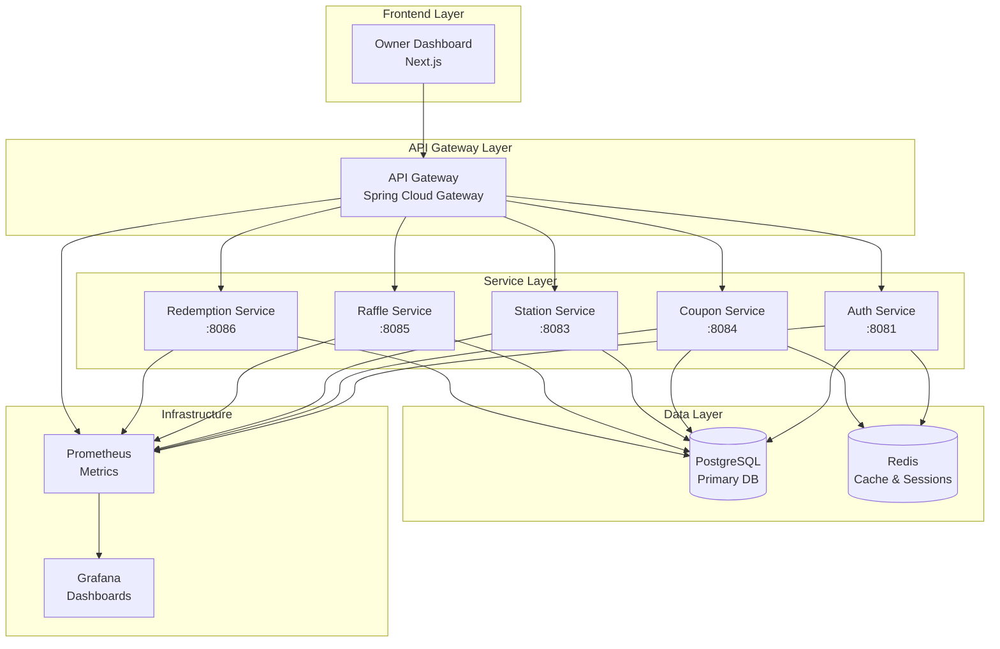
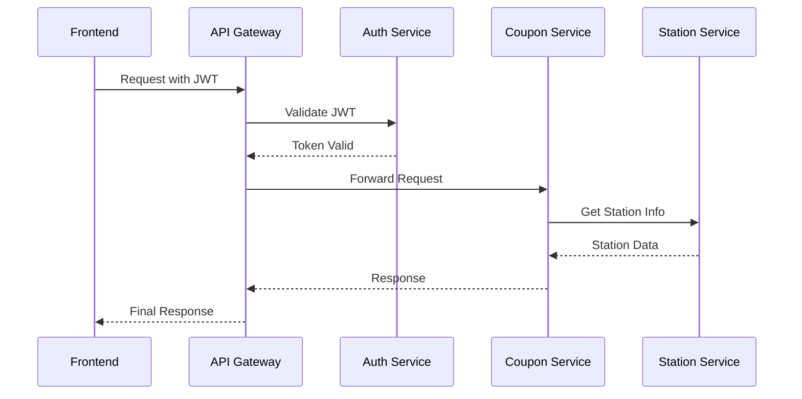
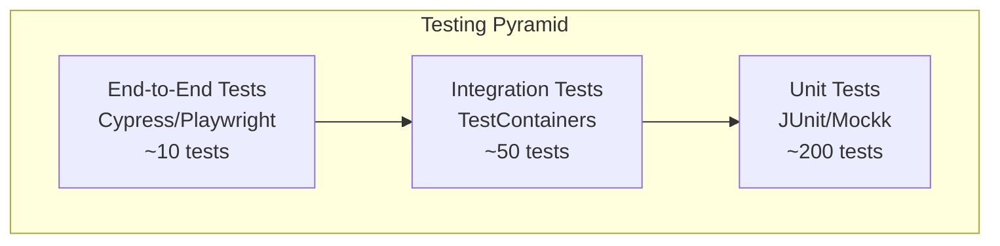

# Design Document - Complete App Functionality

## Overview

This design document outlines the architecture and implementation strategy to complete the Gasolinera JSM Ultimate application, transforming it from a partially functional system to a production-ready platform. The design follows microservices architecture with hexagonal principles and emphasizes reliability, scalability, and maintainability.

## Architecture

### System Architecture Diagram



### Service Communication Pattern



## Components and Interfaces

### 1. API Gateway Enhancement

**Purpose**: Central entry point for all client requests with authentication, routing, and cross-cutting concerns.

**Key Components**:

- **Route Configuration**: Dynamic routing to all services
- **Authentication Filter**: JWT validation and user context injection
- **Circuit Breaker**: Resilience patterns for service failures
- **Rate Limiting**: Protection against abuse
- **Request/Response Logging**: Observability and debugging

**Interfaces**:

```kotlin
// Gateway Configuration
@Configuration
class GatewayConfig {
    fun customRouteLocator(): RouteLocator
    fun authenticationFilter(): GatewayFilter
    fun circuitBreakerConfig(): CircuitBreakerConfig
}

// Security Configuration
@Configuration
class SecurityConfig {
    fun securityWebFilterChain(): SecurityWebFilterChain
    fun jwtDecoder(): ReactiveJwtDecoder
}
```

### 2. Raffle Service Implementation

**Purpose**: Manage lottery/raffle system with transparent winner selection using Merkle Trees.

**Key Components**:

- **Raffle Management**: Create, configure, and manage raffles
- **Participant Management**: Handle user registrations and eligibility
- **Winner Selection**: Cryptographically secure and transparent selection
- **Merkle Tree Integration**: Proof of fairness for winner selection
- **Notification System**: Alert winners and participants

**Domain Model**:

```kotlin
data class Raffle(
    val id: String,
    val name: String,
    val description: String,
    val startDate: LocalDateTime,
    val endDate: LocalDateTime,
    val maxParticipants: Int,
    val prizeDescription: String,
    val status: RaffleStatus,
    val merkleRoot: String? = null
)

data class RaffleParticipant(
    val id: String,
    val raffleId: String,
    val userId: String,
    val participationDate: LocalDateTime,
    val eligibilityProof: String
)

data class RaffleWinner(
    val id: String,
    val raffleId: String,
    val participantId: String,
    val selectionDate: LocalDateTime,
    val merkleProof: List<String>,
    val verified: Boolean
)
```

### 3. Redemption Service Implementation

**Purpose**: Handle coupon redemption, prize claiming, and transaction validation.

**Key Components**:

- **Redemption Processing**: Validate and process coupon redemptions
- **Prize Management**: Handle prize inventory and distribution
- **Transaction Logging**: Audit trail for all redemptions
- **Fraud Detection**: Validate redemption authenticity
- **Integration Layer**: Connect with external payment/reward systems

**Domain Model**:

```kotlin
data class Redemption(
    val id: String,
    val couponId: String,
    val userId: String,
    val stationId: String,
    val redemptionDate: LocalDateTime,
    val amount: BigDecimal,
    val status: RedemptionStatus,
    val transactionId: String?
)

data class Prize(
    val id: String,
    val name: String,
    val description: String,
    val value: BigDecimal,
    val category: PrizeCategory,
    val inventory: Int,
    val active: Boolean
)
```

### 4. Internal SDK Completion

**Purpose**: Provide consistent communication layer between services with shared models and utilities.

**Key Components**:

- **HTTP Client Configuration**: Standardized REST client setup
- **Shared DTOs**: Common data transfer objects across services
- **Error Handling**: Consistent error response formats
- **Authentication Integration**: JWT token propagation
- **Circuit Breaker Integration**: Resilience patterns

**Client Interfaces**:

```kotlin
interface AuthServiceClient {
    suspend fun validateToken(token: String): UserContext
    suspend fun getUserById(userId: String): User
}

interface StationServiceClient {
    suspend fun getStation(stationId: String): Station
    suspend fun getNearbyStations(lat: Double, lng: Double, radius: Double): List<Station>
}

interface CouponServiceClient {
    suspend fun validateCoupon(couponId: String): CouponValidation
    suspend fun redeemCoupon(couponId: String, stationId: String): RedemptionResult
}
```

## Data Models

### Database Schema Design

```sql
-- Raffles Schema
CREATE TABLE raffles (
    id VARCHAR(36) PRIMARY KEY,
    name VARCHAR(255) NOT NULL,
    description TEXT,
    start_date TIMESTAMP NOT NULL,
    end_date TIMESTAMP NOT NULL,
    max_participants INTEGER NOT NULL,
    prize_description TEXT NOT NULL,
    status VARCHAR(50) NOT NULL,
    merkle_root VARCHAR(64),
    created_at TIMESTAMP DEFAULT CURRENT_TIMESTAMP,
    updated_at TIMESTAMP DEFAULT CURRENT_TIMESTAMP
);

CREATE TABLE raffle_participants (
    id VARCHAR(36) PRIMARY KEY,
    raffle_id VARCHAR(36) NOT NULL REFERENCES raffles(id),
    user_id VARCHAR(36) NOT NULL,
    participation_date TIMESTAMP DEFAULT CURRENT_TIMESTAMP,
    eligibility_proof TEXT NOT NULL,
    UNIQUE(raffle_id, user_id)
);

CREATE TABLE raffle_winners (
    id VARCHAR(36) PRIMARY KEY,
    raffle_id VARCHAR(36) NOT NULL REFERENCES raffles(id),
    participant_id VARCHAR(36) NOT NULL REFERENCES raffle_participants(id),
    selection_date TIMESTAMP DEFAULT CURRENT_TIMESTAMP,
    merkle_proof JSONB NOT NULL,
    verified BOOLEAN DEFAULT FALSE
);

-- Redemptions Schema
CREATE TABLE redemptions (
    id VARCHAR(36) PRIMARY KEY,
    coupon_id VARCHAR(36) NOT NULL,
    user_id VARCHAR(36) NOT NULL,
    station_id VARCHAR(36) NOT NULL,
    redemption_date TIMESTAMP DEFAULT CURRENT_TIMESTAMP,
    amount DECIMAL(10,2) NOT NULL,
    status VARCHAR(50) NOT NULL,
    transaction_id VARCHAR(255),
    created_at TIMESTAMP DEFAULT CURRENT_TIMESTAMP
);

CREATE TABLE prizes (
    id VARCHAR(36) PRIMARY KEY,
    name VARCHAR(255) NOT NULL,
    description TEXT,
    value DECIMAL(10,2) NOT NULL,
    category VARCHAR(100) NOT NULL,
    inventory INTEGER NOT NULL DEFAULT 0,
    active BOOLEAN DEFAULT TRUE,
    created_at TIMESTAMP DEFAULT CURRENT_TIMESTAMP,
    updated_at TIMESTAMP DEFAULT CURRENT_TIMESTAMP
);

-- Indexes for performance
CREATE INDEX idx_raffles_status ON raffles(status);
CREATE INDEX idx_raffles_dates ON raffles(start_date, end_date);
CREATE INDEX idx_participants_raffle ON raffle_participants(raffle_id);
CREATE INDEX idx_redemptions_coupon ON redemptions(coupon_id);
CREATE INDEX idx_redemptions_user ON redemptions(user_id);
CREATE INDEX idx_redemptions_station ON redemptions(station_id);
```

### API Response Models

```kotlin
// Standardized API Response Wrapper
data class ApiResponse<T>(
    val success: Boolean,
    val data: T? = null,
    val error: ErrorDetails? = null,
    val timestamp: LocalDateTime = LocalDateTime.now(),
    val correlationId: String
)

data class ErrorDetails(
    val code: String,
    val message: String,
    val details: Map<String, Any> = emptyMap()
)

// Pagination Support
data class PagedResponse<T>(
    val content: List<T>,
    val page: Int,
    val size: Int,
    val totalElements: Long,
    val totalPages: Int,
    val hasNext: Boolean,
    val hasPrevious: Boolean
)
```

## Error Handling

### Global Error Handling Strategy

```kotlin
@RestControllerAdvice
class GlobalExceptionHandler {

    @ExceptionHandler(ValidationException::class)
    fun handleValidation(ex: ValidationException): ResponseEntity<ApiResponse<Nothing>>

    @ExceptionHandler(ResourceNotFoundException::class)
    fun handleNotFound(ex: ResourceNotFoundException): ResponseEntity<ApiResponse<Nothing>>

    @ExceptionHandler(BusinessLogicException::class)
    fun handleBusinessLogic(ex: BusinessLogicException): ResponseEntity<ApiResponse<Nothing>>

    @ExceptionHandler(Exception::class)
    fun handleGeneral(ex: Exception): ResponseEntity<ApiResponse<Nothing>>
}
```

### Circuit Breaker Configuration

```yaml
resilience4j:
  circuitbreaker:
    instances:
      auth-service:
        failure-rate-threshold: 50
        wait-duration-in-open-state: 30s
        sliding-window-size: 10
      coupon-service:
        failure-rate-threshold: 60
        wait-duration-in-open-state: 20s
        sliding-window-size: 8
```

## Testing Strategy

### Testing Pyramid Implementation



### Test Categories

1. **Unit Tests (80% of tests)**:

   - Service layer business logic
   - Repository layer data access
   - Utility functions and mappers
   - Validation logic

2. **Integration Tests (15% of tests)**:

   - API endpoint testing
   - Database integration
   - Service-to-service communication
   - Authentication flows

3. **End-to-End Tests (5% of tests)**:
   - Complete user workflows
   - Cross-service transactions
   - UI functionality
   - Performance benchmarks

### Test Implementation Strategy

```kotlin
// Unit Test Example
@ExtendWith(MockKExtension::class)
class RaffleServiceTest {
    @MockK private lateinit var raffleRepository: RaffleRepository
    @MockK private lateinit var merkleTreeService: MerkleTreeService

    @InjectMockKs private lateinit var raffleService: RaffleService

    @Test
    fun `should create raffle with valid data`() {
        // Given
        val createRequest = CreateRaffleRequest(...)
        every { raffleRepository.save(any()) } returns mockRaffle

        // When
        val result = raffleService.createRaffle(createRequest)

        // Then
        result.shouldNotBeNull()
        verify { raffleRepository.save(any()) }
    }
}

// Integration Test Example
@SpringBootTest(webEnvironment = SpringBootTest.WebEnvironment.RANDOM_PORT)
@Testcontainers
class RaffleControllerIntegrationTest {
    @Container
    val postgres = PostgreSQLContainer<Nothing>("postgres:15")

    @Autowired
    private lateinit var testRestTemplate: TestRestTemplate

    @Test
    fun `should create and retrieve raffle`() {
        // Test implementation
    }
}
```

## Performance Considerations

### Caching Strategy

```kotlin
@Configuration
@EnableCaching
class CacheConfig {

    @Bean
    fun cacheManager(): CacheManager {
        return RedisCacheManager.builder(redisConnectionFactory())
            .cacheDefaults(cacheConfiguration())
            .build()
    }

    private fun cacheConfiguration(): RedisCacheConfiguration {
        return RedisCacheConfiguration.defaultCacheConfig()
            .entryTtl(Duration.ofMinutes(30))
            .serializeKeysWith(RedisSerializationContext.SerializationPair.fromSerializer(StringRedisSerializer()))
            .serializeValuesWith(RedisSerializationContext.SerializationPair.fromSerializer(GenericJackson2JsonRedisSerializer()))
    }
}
```

### Database Optimization

1. **Connection Pooling**: HikariCP configuration for optimal connection management
2. **Query Optimization**: Proper indexing and query analysis
3. **Read Replicas**: Separate read/write operations for scalability
4. **Connection Limits**: Proper pool sizing based on service requirements

### Monitoring and Observability

```kotlin
@Component
class MetricsConfiguration {

    @Bean
    fun meterRegistry(): MeterRegistry {
        return PrometheusMeterRegistry(PrometheusConfig.DEFAULT)
    }

    @EventListener
    fun handleServiceMetrics(event: ServiceMetricEvent) {
        Metrics.counter("service.requests", "service", event.serviceName).increment()
        Metrics.timer("service.response.time", "service", event.serviceName)
            .record(event.responseTime, TimeUnit.MILLISECONDS)
    }
}
```

## Security Implementation

### JWT Token Validation

```kotlin
@Component
class JwtAuthenticationFilter : OncePerRequestFilter() {

    override fun doFilterInternal(
        request: HttpServletRequest,
        response: HttpServletResponse,
        filterChain: FilterChain
    ) {
        val token = extractToken(request)
        if (token != null && jwtService.validateToken(token)) {
            val userContext = jwtService.getUserContext(token)
            SecurityContextHolder.getContext().authentication =
                JwtAuthenticationToken(userContext)
        }
        filterChain.doFilter(request, response)
    }
}
```

### CORS Configuration

```kotlin
@Configuration
class CorsConfig {

    @Bean
    fun corsConfigurationSource(): CorsConfigurationSource {
        val configuration = CorsConfiguration()
        configuration.allowedOriginPatterns = listOf("http://localhost:*", "https://*.gasolinerajsm.com")
        configuration.allowedMethods = listOf("GET", "POST", "PUT", "DELETE", "OPTIONS")
        configuration.allowedHeaders = listOf("*")
        configuration.allowCredentials = true
        configuration.maxAge = 3600L

        val source = UrlBasedCorsConfigurationSource()
        source.registerCorsConfiguration("/**", configuration)
        return source
    }
}
```

## Deployment Strategy

### Docker Configuration

```dockerfile
# Multi-stage build for services
FROM openjdk:17-jdk-slim as builder
WORKDIR /app
COPY . .
RUN ./gradlew build -x test

FROM openjdk:17-jre-slim
WORKDIR /app
COPY --from=builder /app/build/libs/*.jar app.jar
EXPOSE 8080
HEALTHCHECK --interval=30s --timeout=3s --start-period=5s --retries=3 \
  CMD curl -f http://localhost:8080/actuator/health || exit 1
ENTRYPOINT ["java", "-jar", "app.jar"]
```

### Docker Compose Production

```yaml
version: '3.8'
services:
  api-gateway:
    build: ./services/api-gateway
    ports:
      - '8080:8080'
    environment:
      - SPRING_PROFILES_ACTIVE=prod
      - JWT_SECRET=${JWT_SECRET}
    depends_on:
      - postgres
      - redis
    healthcheck:
      test: ['CMD', 'curl', '-f', 'http://localhost:8080/actuator/health']
      interval: 30s
      timeout: 10s
      retries: 3

  postgres:
    image: postgres:15
    environment:
      POSTGRES_DB: gasolinera_jsm
      POSTGRES_USER: ${DB_USER}
      POSTGRES_PASSWORD: ${DB_PASSWORD}
    volumes:
      - postgres_data:/var/lib/postgresql/data
      - ./database/init:/docker-entrypoint-initdb.d
    healthcheck:
      test: ['CMD-SHELL', 'pg_isready -U ${DB_USER}']
      interval: 10s
      timeout: 5s
      retries: 5

volumes:
  postgres_data:
```

This design provides a comprehensive roadmap for completing the Gasolinera JSM Ultimate application with production-ready architecture, proper testing, security, and deployment strategies.
