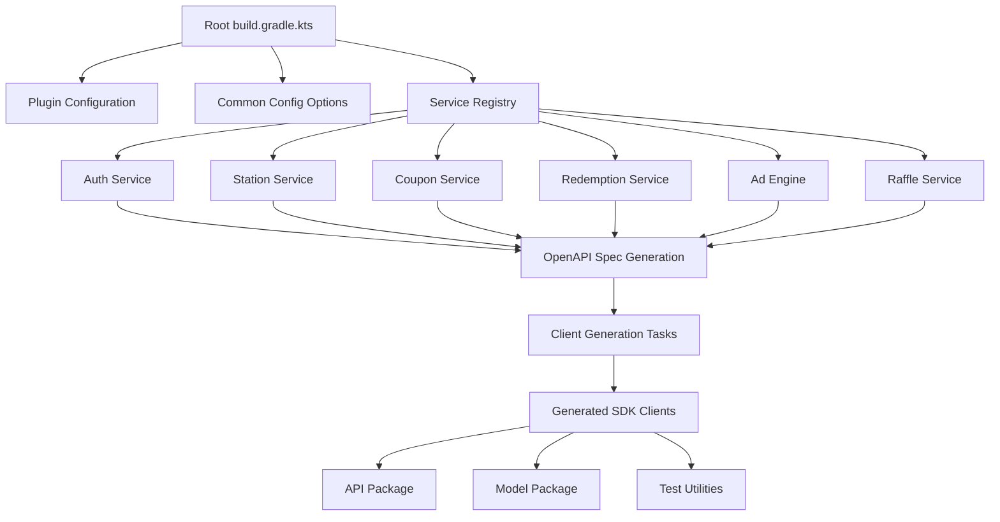
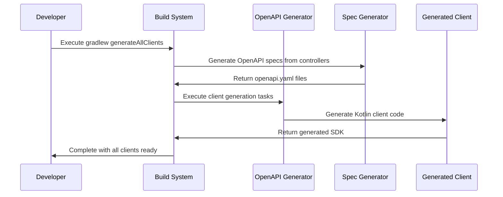

# Design Document - OpenAPI Client Optimization

## Overview

This design establishes a comprehensive system for generating, managing, and maintaining OpenAPI clients across all services in the Gasolinera JSM monorepo. The solution focuses on automation, consistency, and production readiness while providing a scalable foundation for future services.

## Architecture

### High-Level Architecture



### Component Interaction Flow



## Components and Interfaces

### 1. Plugin Management System

**Purpose**: Centralize all plugin configurations to ensure version consistency and avoid conflicts.

**Implementation**:

```kotlin
// Root build.gradle.kts - Plugin Configuration
plugins {
    id("org.openapi.generator") version "7.0.1"
    id("org.springdoc.openapi-gradle-plugin") version "1.8.0"
    kotlin("jvm") version "1.9.24" apply false
    kotlin("plugin.spring") version "1.9.24" apply false
    kotlin("plugin.jpa") version "1.9.24" apply false
    id("org.springframework.boot") version "3.3.3" apply false
    id("io.spring.dependency-management") version "1.1.6" apply false
}
```

**Key Features**:

- All plugins defined with `apply false` to prevent automatic application
- Version management centralized in root project
- Subprojects apply plugins without version specification

### 2. OpenAPI Specification Generator

**Purpose**: Automatically generate OpenAPI specifications from existing Spring Boot controllers.

**Implementation Strategy**:

- Use SpringDoc OpenAPI plugin to generate specs from annotations
- Configure automatic generation during build process
- Ensure all controllers are properly annotated

**Configuration**:

```kotlin
// Add to each service's build.gradle.kts
plugins {
    id("org.springdoc.openapi-gradle-plugin")
}

openApi {
    apiDocsUrl.set("http://localhost:8080/v3/api-docs")
    outputDir.set(file("$projectDir"))
    outputFileName.set("openapi.yaml")
    waitTimeInSeconds.set(10)
}
```

### 3. Service Registry System

**Purpose**: Maintain a centralized registry of all services with their configuration details.

**Data Structure**:

```kotlin
data class ServiceConfig(
    val name: String,
    val servicePath: String,
    val sdkPackage: String,
    val port: Int,
    val apiVersion: String = "v1",
    val hasOpenApi: Boolean = true
)

val serviceRegistry = listOf(
    ServiceConfig("Auth", "auth-service", "com.gasolinerajsm.sdk.auth", 8081),
    ServiceConfig("Station", "station-service", "com.gasolinerajsm.sdk.station", 8083),
    ServiceConfig("Coupon", "coupon-service", "com.gasolinerajsm.sdk.coupon", 8086),
    ServiceConfig("Redemption", "redemption-service", "com.gasolinerajsm.sdk.redemption", 8082),
    ServiceConfig("AdEngine", "ad-engine", "com.gasolinerajsm.sdk.adengine", 8084),
    ServiceConfig("Raffle", "raffle-service", "com.gasolinerajsm.sdk.raffle", 8085)
)
```

### 4. Client Generation Engine

**Purpose**: Generate consistent, high-quality Kotlin clients for all services.

**Generator Configuration**:

```kotlin
val commonConfigOptions = mapOf(
    // Core Configuration
    "dateLibrary" to "java8",
    "library" to "jvm-spring-webclient",
    "serializationLibrary" to "jackson",

    // Kotlin Specific
    "useCoroutines" to "true",
    "explicitApi" to "true",

    // Validation and Documentation
    "useBeanValidation" to "true",
    "annotationLibrary" to "swagger2",
    "documentationProvider" to "springdoc",

    // Code Generation Options
    "interfaceOnly" to "false",
    "skipFormModel" to "true",
    "skipDefaultInterface" to "false",
    "useTags" to "true",
    "openApiNullable" to "false",

    // Additional Features
    "generateClientAsBean" to "true",
    "useSpringBoot3" to "true",
    "reactive" to "false"
)
```

**Generator Selection Rationale**:

- **Primary**: `kotlin` generator with `jvm-spring-webclient` library
- **Reason**: Better suited for client generation vs `kotlin-spring` (server generator)
- **Benefits**: Spring WebClient integration, coroutines support, proper client patterns

### 5. Package Structure System

**Purpose**: Ensure consistent and predictable package organization across all generated clients.

**Package Naming Convention**:

```
com.gasolinerajsm.sdk.{service}
├── api/           # API interfaces and client classes
├── model/         # Data models and DTOs
├── infrastructure/ # HTTP client configuration
└── auth/          # Authentication utilities
```

**Output Directory Structure**:

```
build/generated/
├── auth-service-client/
├── station-service-client/
├── coupon-service-client/
├── redemption-service-client/
├── ad-engine-client/
└── raffle-service-client/
```

## Data Models

### Service Configuration Model

```kotlin
data class ServiceConfig(
    val name: String,                    // Display name (e.g., "Auth")
    val servicePath: String,             // Directory name (e.g., "auth-service")
    val sdkPackage: String,              // Base package for generated code
    val port: Int,                       // Service port for local development
    val apiVersion: String = "v1",       // API version
    val hasOpenApi: Boolean = true,      // Whether to generate OpenAPI spec
    val generatorName: String = "kotlin", // OpenAPI generator to use
    val library: String = "jvm-spring-webclient" // Client library
)
```

### Generation Task Configuration

```kotlin
data class GenerationTaskConfig(
    val taskName: String,               // Gradle task name
    val inputSpec: String,              // Path to openapi.yaml
    val outputDir: String,              // Output directory
    val apiPackage: String,             // API package name
    val modelPackage: String,           // Model package name
    val configOptions: Map<String, String> // Generator options
)
```

## Error Handling

### Build-Time Error Handling

1. **Missing OpenAPI Specifications**:
   - Validate that openapi.yaml exists for each service
   - Provide clear error messages with resolution steps
   - Offer automatic generation from controllers

2. **Generation Failures**:
   - Catch and report generator-specific errors
   - Provide debugging information
   - Suggest common fixes

3. **Package Conflicts**:
   - Validate package naming conventions
   - Check for duplicate package names
   - Ensure no conflicts with existing code

### Runtime Error Handling

1. **Client Configuration Errors**:
   - Validate service URLs and ports
   - Handle authentication failures gracefully
   - Provide meaningful error messages

2. **Network and Connectivity**:
   - Implement retry mechanisms
   - Handle timeouts appropriately
   - Support circuit breaker patterns

## Testing Strategy

### 1. Generation Testing

**Unit Tests for Build Logic**:

```kotlin
class ClientGenerationTest {
    @Test
    fun `should generate all configured clients`() {
        // Test that all services in registry have generation tasks
    }

    @Test
    fun `should use consistent package naming`() {
        // Validate package naming conventions
    }

    @Test
    fun `should apply common configuration options`() {
        // Verify configuration consistency
    }
}
```

### 2. Generated Client Testing

**Integration Tests**:

```kotlin
class GeneratedClientIntegrationTest {
    @Test
    fun `auth client should authenticate successfully`() {
        // Test actual API calls with generated client
    }

    @Test
    fun `station client should perform CRUD operations`() {
        // Test full CRUD cycle with generated client
    }
}
```

### 3. Build Process Testing

**Gradle Task Testing**:

- Verify all generation tasks execute successfully
- Test incremental builds and caching
- Validate output directory structure

## Implementation Phases

### Phase 1: Foundation Setup

1. Update root build.gradle.kts with improved plugin management
2. Add SpringDoc OpenAPI plugin to all services
3. Configure service registry with all existing services

### Phase 2: Specification Generation

1. Generate OpenAPI specs from existing controllers
2. Validate and enhance API documentation
3. Ensure all endpoints are properly documented

### Phase 3: Client Generation Enhancement

1. Implement improved generator configuration
2. Update package naming and structure
3. Add missing services to generation pipeline

### Phase 4: Testing and Validation

1. Create comprehensive test suite
2. Validate all generated clients
3. Test integration scenarios

### Phase 5: Production Readiness

1. Add CI/CD integration
2. Create documentation and usage guides
3. Implement monitoring and validation scripts

## Configuration Files

### Root Build Configuration Enhancement

```kotlin
// Enhanced service registry with full configuration
val serviceRegistry = listOf(
    ServiceConfig(
        name = "Auth",
        servicePath = "auth-service",
        sdkPackage = "com.gasolinerajsm.sdk.auth",
        port = 8081,
        apiVersion = "v1"
    ),
    // ... other services
)

// Dynamic task generation with enhanced configuration
serviceRegistry.forEach { service ->
    // OpenAPI generation task
    tasks.register("generate${service.name}OpenApi", org.springdoc.openapi.gradle.plugin.OpenApiGeneratorTask::class) {
        apiDocsUrl.set("http://localhost:${service.port}/v3/api-docs")
        outputDir.set(file("services/${service.servicePath}"))
        outputFileName.set("openapi.yaml")
    }

    // Client generation task
    tasks.register("generate${service.name}Client", org.openapitools.generator.gradle.plugin.tasks.GenerateTask::class) {
        dependsOn("generate${service.name}OpenApi")
        generatorName.set(service.generatorName)
        library.set(service.library)
        inputSpec.set("$projectDir/services/${service.servicePath}/openapi.yaml")
        outputDir.set("${layout.buildDirectory.get()}/generated/${service.servicePath}-client")
        apiPackage.set("${service.sdkPackage}.api")
        modelPackage.set("${service.sdkPackage}.model")
        configOptions.set(commonConfigOptions)
    }
}

// Aggregate task to generate all clients
tasks.register("generateAllClients") {
    dependsOn(serviceRegistry.map { "generate${it.name}Client" })
    group = "openapi tools"
    description = "Generates all API clients for the monorepo"
}
```

This design provides a robust, scalable, and maintainable solution for OpenAPI client generation that meets all the requirements while establishing best practices for future development.
