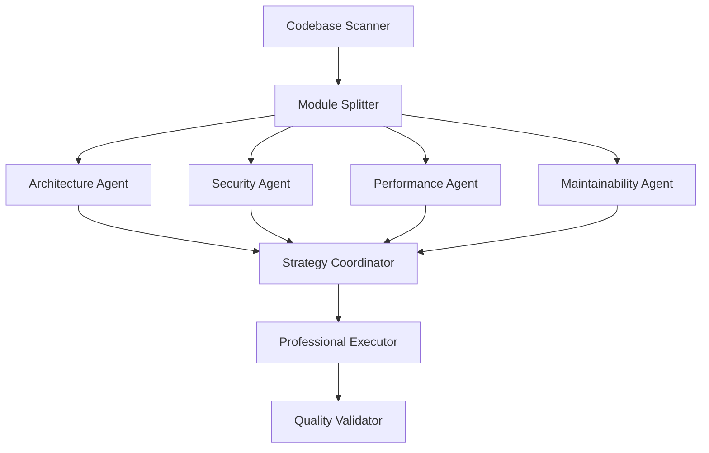

# Design Document

## Overview

This design outlines a systematic approach to conducting a comprehensive architecture review and improvement initiative for the Gasolinera JSM platform. The solution employs a multi-agent analysis framework where specialized agents focus on different aspects of the system (architecture, security, performance, maintainability) before consolidating findings into a prioritized improvement plan and executing changes safely.

The design ensures thorough coverage of the entire codebase while maintaining system stability and avoiding context overload through modular analysis approaches.

## Architecture

### Multi-Agent Analysis Framework

The system employs six specialized agents working in a coordinated pipeline:



### Analysis Scope Partitioning

To manage complexity and avoid context overload, the analysis is partitioned into logical modules:

1. **Backend Services Module**: Individual microservices analysis
2. **Frontend Applications Module**: Web and mobile app analysis
3. **Shared Libraries Module**: Common packages and SDKs
4. **Infrastructure Module**: Docker, Kubernetes, and deployment configs
5. **Integration Module**: Inter-service communication and data flow
6. **Testing Module**: Test coverage and quality assessment

### Agent Specializations

#### 1. Software Architect Agent

- **Focus**: System design, service boundaries, dependency management
- **Analysis Areas**:
  - Microservice architecture patterns
  - API design and versioning
  - Data flow and service communication
  - Scalability bottlenecks
  - Design pattern consistency

#### 2. Security & Best Practices Agent

- **Focus**: Security vulnerabilities, authentication, authorization
- **Analysis Areas**:
  - OWASP Top 10 compliance
  - JWT implementation security
  - Input validation and sanitization
  - Dependency vulnerability scanning
  - Secrets management practices

#### 3. Performance Optimizer Agent

- **Focus**: Code efficiency, database optimization, resource usage
- **Analysis Areas**:
  - Database query optimization
  - Memory usage patterns
  - API response times
  - Frontend bundle optimization
  - Caching strategies

#### 4. Developer Experience Agent

- **Focus**: Code quality, maintainability, documentation
- **Analysis Areas**:
  - Code style consistency
  - Type safety implementation
  - Test coverage and quality
  - Documentation completeness
  - Development workflow efficiency

## Components and Interfaces

### Analysis Engine

```typescript
interface AnalysisEngine {
  scanCodebase(): Promise<CodebaseStructure>;
  partitionModules(structure: CodebaseStructure): AnalysisModule[];
  analyzeModule(
    module: AnalysisModule,
    agents: Agent[]
  ): Promise<AnalysisResult[]>;
  consolidateFindings(results: AnalysisResult[]): Promise<ImprovementPlan>;
}
```

### Agent Interface

```typescript
interface Agent {
  id: string;
  role: AgentRole;
  analyze(module: AnalysisModule): Promise<Finding[]>;
  prioritize(findings: Finding[]): Promise<PrioritizedFinding[]>;
}

enum AgentRole {
  ARCHITECT = 'Software Architect',
  SECURITY = 'Security & Best Practices Expert',
  PERFORMANCE = 'Code & Performance Optimizer',
  MAINTAINABILITY = 'Developer Experience & Maintainability Specialist',
  COORDINATOR = 'Strategy Coordinator',
  EXECUTOR = 'Professional Executor',
}
```

### Finding Classification

```typescript
interface Finding {
  id: string;
  category: FindingCategory;
  severity: Severity;
  location: CodeLocation;
  description: string;
  recommendation: string;
  estimatedEffort: EffortLevel;
  businessImpact: ImpactLevel;
}

enum FindingCategory {
  ARCHITECTURE = 'architecture',
  SECURITY = 'security',
  PERFORMANCE = 'performance',
  MAINTAINABILITY = 'maintainability',
}

enum Severity {
  CRITICAL = 'critical',
  HIGH = 'high',
  MEDIUM = 'medium',
  LOW = 'low',
}
```

## Data Models

### Codebase Structure Model

```typescript
interface CodebaseStructure {
  services: ServiceModule[];
  applications: ApplicationModule[];
  packages: PackageModule[];
  infrastructure: InfrastructureModule[];
  tests: TestModule[];
}

interface ServiceModule {
  name: string;
  path: string;
  language: 'kotlin' | 'typescript';
  framework: string;
  dependencies: Dependency[];
  endpoints: ApiEndpoint[];
  database: DatabaseConfig;
}

interface ApplicationModule {
  name: string;
  type: 'web' | 'mobile';
  framework: string;
  components: Component[];
  routes: Route[];
  stateManagement: StateConfig;
}
```

### Improvement Plan Model

```typescript
interface ImprovementPlan {
  phases: ImprovementPhase[];
  quickWins: QuickWin[];
  majorInitiatives: MajorInitiative[];
  estimatedTimeline: Timeline;
}

interface ImprovementPhase {
  name: string;
  description: string;
  tasks: ImprovementTask[];
  dependencies: string[];
  estimatedDuration: Duration;
}

interface ImprovementTask {
  id: string;
  title: string;
  description: string;
  category: FindingCategory;
  files: string[];
  changes: CodeChange[];
  tests: TestRequirement[];
}
```

## Error Handling

### Analysis Error Recovery

1. **Module Analysis Failure**: Continue with other modules, flag failed module for manual review
2. **Agent Communication Error**: Retry with exponential backoff, fallback to reduced analysis scope
3. **Code Parsing Error**: Skip problematic files, log for manual inspection
4. **Memory/Context Overflow**: Automatically partition large modules into smaller chunks

### Implementation Safety Measures

1. **Backup Creation**: Create git branches before any modifications
2. **Incremental Changes**: Apply changes in small, reviewable commits
3. **Rollback Capability**: Maintain ability to revert any change set
4. **Validation Gates**: Run tests after each change group

## Testing Strategy

### Analysis Validation

1. **Agent Output Validation**: Verify each agent produces expected finding formats
2. **Cross-Agent Consistency**: Ensure findings don't conflict between agents
3. **Completeness Checks**: Verify all modules are analyzed by all relevant agents

### Implementation Testing

1. **Pre-Change Testing**: Run full test suite before any modifications
2. **Incremental Testing**: Run relevant tests after each change group
3. **Integration Testing**: Verify service interactions remain functional
4. **Performance Regression Testing**: Ensure optimizations don't introduce new issues

### Quality Gates

```typescript
interface QualityGate {
  name: string;
  criteria: QualityCriteria[];
  required: boolean;
}

interface QualityCriteria {
  metric: string;
  threshold: number;
  comparison: 'greater_than' | 'less_than' | 'equals';
}

const qualityGates: QualityGate[] = [
  {
    name: 'Test Coverage',
    criteria: [
      { metric: 'line_coverage', threshold: 80, comparison: 'greater_than' },
    ],
    required: true,
  },
  {
    name: 'Security Scan',
    criteria: [
      {
        metric: 'critical_vulnerabilities',
        threshold: 0,
        comparison: 'equals',
      },
    ],
    required: true,
  },
  {
    name: 'Performance Baseline',
    criteria: [
      {
        metric: 'api_response_time_p95',
        threshold: 500,
        comparison: 'less_than',
      },
    ],
    required: false,
  },
];
```

## Implementation Phases

### Phase 1: Analysis and Discovery (Week 1-2)

- Complete codebase scanning and module partitioning
- Run all four specialized agents across all modules
- Generate comprehensive findings database
- Initial prioritization by Strategy Coordinator

### Phase 2: Planning and Prioritization (Week 3)

- Consolidate findings into improvement plan
- Identify quick wins and major initiatives
- Create detailed implementation roadmap
- Stakeholder review and approval

### Phase 3: Quick Wins Implementation (Week 4-5)

- Apply low-risk, high-impact improvements
- Focus on code style, documentation, and simple optimizations
- Validate changes don't introduce regressions

### Phase 4: Security and Performance Improvements (Week 6-8)

- Implement security vulnerability fixes
- Apply performance optimizations
- Update dependencies and configurations
- Comprehensive testing and validation

### Phase 5: Architecture Improvements (Week 9-12)

- Refactor service boundaries and interfaces
- Improve modularity and code organization
- Update infrastructure configurations
- Final integration testing and documentation

### Phase 6: Validation and Documentation (Week 13)

- Complete system testing
- Update all documentation
- Create improvement summary report
- Knowledge transfer and team training
