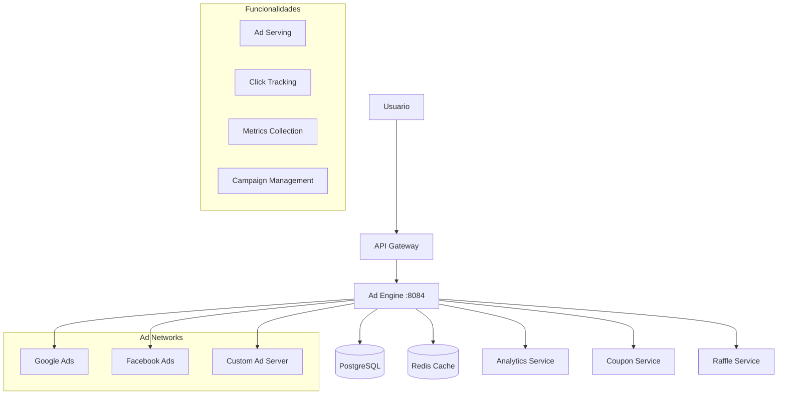

# Ad Engine Service

## 🎯 Descripción General

El Ad Engine es el motor de publicidad de Gasolinera JSM que gestiona la visualización de anuncios gamificados. Los usuarios pueden ver anuncios progresivos (10s → 15s → 30s → 1m → hasta 10m) para multiplicar sus tickets de rifa, creando una experiencia publicitaria interactiva y recompensada.

## 🏗️ Arquitectura



## 🚀 Funcionalidades Principales

### ✅ Implementadas

- **Serving de Anuncios**: Entrega de anuncios basada en duración progresiva
- **Autenticación JWT**: Validación de tokens de usuario
- **Tracking Básico**: Registro de visualizaciones y clicks
- **Health Checks**: Monitoreo de estado del servicio
- **Configuración por Perfiles**: Diferentes configuraciones por ambiente

### 🔧 En Desarrollo

- **Sistema de Métricas Avanzadas**: Analytics detallados de rendimiento
- **Gestión de Campañas**: CRUD completo de campañas publicitarias
- **Integración con Ad Networks**: Conectores para plataformas externas
- **Targeting Inteligente**: Segmentación por ubicación y demografía
- **Optimización de Revenue**: Algoritmos de maximización de ingresos

## 📋 API Endpoints

### Anuncios para Usuarios

```yaml
# Obtener anuncio disponible
GET /api/ads/next
Headers:
  Authorization: Bearer <jwt-token>
Response:
  {
    "adId": "ad-123",
    "duration": 10,
    "multiplier": 2,
    "videoUrl": "https://...",
    "skipAfter": 5
  }

# Registrar visualización completa
POST /api/ads/{adId}/view
Headers:
  Authorization: Bearer <jwt-token>
Body:
  {
    "watchedDuration": 10,
    "completed": true,
    "userId": "user-123"
  }

# Registrar click en anuncio
POST /api/ads/{adId}/click
Headers:
  Authorization: Bearer <jwt-token>
Body:
  {
    "clickPosition": {"x": 100, "y": 200},
    "timestamp": "2025-08-23T10:30:00Z"
  }
```

### Gestión de Campañas (Admin/Advertiser)

```yaml
# Listar campañas
GET /api/ads/campaigns
Headers:
  Authorization: Bearer <admin-token>

# Crear nueva campaña
POST /api/ads/campaigns
Headers:
  Authorization: Bearer <admin-token>
Body:
  {
    "name": "Campaña Verano 2025",
    "budget": 10000,
    "startDate": "2025-09-01",
    "endDate": "2025-09-30",
    "targeting": {
      "locations": ["San José", "Cartago"],
      "ageRange": [18, 65],
      "interests": ["automotive", "fuel"]
    }
  }

# Actualizar campaña
PUT /api/ads/campaigns/{campaignId}

# Eliminar campaña
DELETE /api/ads/campaigns/{campaignId}
```

### Analytics y Métricas

```yaml
# Métricas de campaña
GET /api/ads/campaigns/{campaignId}/metrics
Response:
  {
    "impressions": 15420,
    "clicks": 892,
    "ctr": 5.78,
    "conversions": 45,
    "revenue": 2340.50,
    "costPerClick": 2.62
  }

# Métricas generales
GET /api/ads/metrics/summary
Response:
  {
    "totalImpressions": 125000,
    "totalClicks": 7200,
    "totalRevenue": 18500.75,
    "activeCampaigns": 12,
    "topPerformingAd": "ad-456"
  }
```

## 🔒 Seguridad y Autenticación

### Roles y Permisos

| Rol          | Permisos                                       |
| ------------ | ---------------------------------------------- |
| `USER`       | Ver anuncios, registrar visualizaciones        |
| `ADVERTISER` | Gestionar sus campañas, ver métricas           |
| `ADMIN`      | Acceso completo, gestión de todas las campañas |

### Validación JWT

```kotlin
// Configuración JWT
jwt:
  secret: ${JWT_SECRET}
  expiration: 86400000 # 24 horas

// Headers requeridos
Authorization: Bearer <jwt-token>
X-User-Id: <user-id>
X-User-Roles: USER,ADVERTISER
```

## 🔧 Configuración

### Variables de Entorno

```bash
# Configuración del Servicio
SERVER_PORT=8084
SPRING_PROFILES_ACTIVE=development

# Base de Datos
DATABASE_URL=jdbc:postgresql://localhost:5432/gasolinera_jsm
DATABASE_USERNAME=postgres
DATABASE_PASSWORD=password

# Redis
REDIS_HOST=localhost
REDIS_PORT=6379
REDIS_PASSWORD=

# JWT
JWT_SECRET=your-super-secret-jwt-key
JWT_EXPIRATION=86400000

# Ad Networks
GOOGLE_ADS_CLIENT_ID=your-google-ads-client-id
GOOGLE_ADS_CLIENT_SECRET=your-google-ads-secret
FACEBOOK_ADS_ACCESS_TOKEN=your-facebook-token

# Analytics
ANALYTICS_ENABLED=true
ANALYTICS_BATCH_SIZE=100
ANALYTICS_FLUSH_INTERVAL=30000

# Rate Limiting
RATE_LIMIT_REQUESTS_PER_MINUTE=60
RATE_LIMIT_BURST_CAPACITY=100
```

### Configuración por Ambiente

#### Development (`application-development.yml`)

```yaml
spring:
  datasource:
    url: jdbc:postgresql://localhost:5432/gasolinera_jsm
    username: postgres
    password: password

  jpa:
    hibernate:
      ddl-auto: update
    show-sql: true

ad-engine:
  cache:
    ttl: 300 # 5 minutos
  serving:
    default-duration: 10
    max-duration: 600 # 10 minutos

logging:
  level:
    com.gasolinerajsm.adengine: DEBUG
```

#### Production (`application-production.yml`)

```yaml
spring:
  datasource:
    url: ${DATABASE_URL}
    username: ${DATABASE_USERNAME}
    password: ${DATABASE_PASSWORD}

  jpa:
    hibernate:
      ddl-auto: validate
    show-sql: false

ad-engine:
  cache:
    ttl: 3600 # 1 hora
  serving:
    default-duration: 15
    max-duration: 600

logging:
  level:
    com.gasolinerajsm.adengine: INFO
```

## 🚀 Instalación y Ejecución

### Prerrequisitos

- Java 17+
- PostgreSQL 13+
- Redis 6+

### Ejecución Local

```bash
# Clonar el repositorio
git clone <repository-url>
cd services/ad-engine

# Configurar variables de entorno
cp .env.example .env
# Editar .env con tus configuraciones

# Ejecutar con Gradle
./gradlew bootRun

# O con perfil específico
./gradlew bootRun --args='--spring.profiles.active=development'
```

### Ejecución con Docker

```bash
# Construir imagen
docker build -t gasolinera-jsm/ad-engine .

# Ejecutar contenedor
docker run -p 8084:8084 \
  -e SPRING_PROFILES_ACTIVE=development \
  -e DATABASE_URL=jdbc:postgresql://postgres:5432/gasolinera_jsm \
  gasolinera-jsm/ad-engine
```

### Ejecución con Docker Compose

```bash
# Desde el directorio raíz del proyecto
docker-compose -f docker-compose.dev.yml up ad-engine
```

## 📊 Monitoreo y Métricas

### Health Checks

```bash
# Health check general
curl http://localhost:8084/actuator/health

# Health check detallado
curl http://localhost:8084/actuator/health/detailed
```

### Métricas Disponibles

```bash
# Métricas de Prometheus
curl http://localhost:8084/actuator/prometheus

# Métricas específicas del Ad Engine
curl http://localhost:8084/actuator/metrics/ads.served
curl http://localhost:8084/actuator/metrics/ads.clicked
curl http://localhost:8084/actuator/metrics/ads.revenue
```

### Métricas de Negocio

| Métrica                | Descripción                        | Tipo      |
| ---------------------- | ---------------------------------- | --------- |
| `ads_served_total`     | Total de anuncios servidos         | Counter   |
| `ads_clicked_total`    | Total de clicks en anuncios        | Counter   |
| `ads_completed_total`  | Anuncios vistos completamente      | Counter   |
| `ads_revenue_total`    | Ingresos totales generados         | Counter   |
| `ads_duration_seconds` | Duración promedio de visualización | Histogram |
| `campaigns_active`     | Campañas activas                   | Gauge     |

## 🧪 Testing

### Tests Unitarios

```bash
# Ejecutar todos los tests
./gradlew test

# Ejecutar tests específicos
./gradlew test --tests "*AdServiceTest*"

# Tests con cobertura
./gradlew test jacocoTestReport
```

### Tests de Integración

```bash
# Tests de integración con TestContainers
./gradlew integrationTest

# Tests de API endpoints
./gradlew apiTest
```

### Ejemplos de Requests

#### Obtener Anuncio

```bash
curl -X GET http://localhost:8084/api/ads/next \
  -H "Authorization: Bearer <jwt-token>" \
  -H "Content-Type: application/json"
```

#### Registrar Visualización

```bash
curl -X POST http://localhost:8084/api/ads/ad-123/view \
  -H "Authorization: Bearer <jwt-token>" \
  -H "Content-Type: application/json" \
  -d '{
    "watchedDuration": 10,
    "completed": true,
    "userId": "user-123"
  }'
```

## 🔍 Troubleshooting

### Problemas Comunes

#### 1. Anuncios No Se Cargan

```bash
# Verificar conectividad con ad networks
curl -I https://googleads.g.doubleclick.net/

# Verificar configuración de campañas
curl http://localhost:8084/api/ads/campaigns \
  -H "Authorization: Bearer <admin-token>"
```

#### 2. Métricas No Se Registran

```bash
# Verificar conexión a Redis
redis-cli ping

# Verificar logs de analytics
docker logs ad-engine | grep analytics
```

#### 3. JWT Token Invalid

```bash
# Verificar configuración JWT
echo $JWT_SECRET

# Validar token
curl -X POST http://localhost:8080/api/gateway/validate-token \
  -H "Authorization: Bearer <jwt-token>"
```

### Logs Útiles

```bash
# Ver logs del Ad Engine
docker logs ad-engine

# Ver logs con filtro
docker logs ad-engine | grep ERROR

# Logs en tiempo real
docker logs -f ad-engine
```

## 📈 Modelo de Negocio

### Sistema de Multiplicadores

| Duración | Multiplicador | Revenue Share                |
| -------- | ------------- | ---------------------------- |
| 10s      | 2x tickets    | 70% advertiser, 30% platform |
| 15s      | 3x tickets    | 65% advertiser, 35% platform |
| 30s      | 5x tickets    | 60% advertiser, 40% platform |
| 1m       | 8x tickets    | 55% advertiser, 45% platform |
| 5m       | 15x tickets   | 50% advertiser, 50% platform |
| 10m      | 25x tickets   | 45% advertiser, 55% platform |

### Targeting Options

- **Geográfico**: Por provincia, cantón, distrito
- **Demográfico**: Edad, género, nivel socioeconómico
- **Comportamental**: Frecuencia de visita, gasto promedio
- **Temporal**: Horarios, días de la semana, estacionalidad

## 🔗 Integraciones

### Servicios Internos

- **Coupon Service**: Recibe eventos de activación de cupones
- **Raffle Service**: Envía multiplicadores de tickets ganados
- **Auth Service**: Validación de tokens y permisos
- **Analytics Service**: Envío de métricas y eventos

### Servicios Externos

- **Google Ads**: Integración con Google AdMob
- **Facebook Ads**: Facebook Audience Network
- **Custom Ad Networks**: APIs de terceros
- **Analytics Platforms**: Google Analytics, Mixpanel

## 📚 Documentación Adicional

### API Documentation

- **Swagger UI**: http://localhost:8084/swagger-ui.html
- **OpenAPI Spec**: http://localhost:8084/v3/api-docs

### Arquitectura

- [Diagrama de Arquitectura](./docs/architecture.md)
- [Flujo de Anuncios](./docs/ad-flow.md)
- [Integración con Ad Networks](./docs/integrations.md)

### Operaciones

- [Guía de Deployment](./docs/deployment.md)
- [Monitoreo y Alertas](./docs/monitoring.md)
- [Runbook de Incidentes](./docs/runbook.md)

## 🤝 Contribución

### Desarrollo

1. Fork el repositorio
2. Crear branch de feature: `git checkout -b feature/nueva-funcionalidad`
3. Commit cambios: `git commit -am 'Agregar nueva funcionalidad'`
4. Push al branch: `git push origin feature/nueva-funcionalidad`
5. Crear Pull Request

### Estándares de Código

- Seguir convenciones de Kotlin
- Documentar funciones públicas
- Incluir tests para nueva funcionalidad
- Mantener cobertura de tests > 80%

## 📄 Licencia

Este proyecto está bajo la Licencia MIT. Ver [LICENSE](../../LICENSE) para más detalles.

---

## 🔗 Enlaces Útiles

- [Google Ads API Documentation](https://developers.google.com/google-ads/api/docs)
- [Facebook Marketing API](https://developers.facebook.com/docs/marketing-apis)
- [Spring Boot Actuator](https://docs.spring.io/spring-boot/docs/current/reference/html/actuator.html)
- [Micrometer Metrics](https://micrometer.io/docs)

---

**Mantenido por**: Equipo de Desarrollo Gasolinera JSM
**Última actualización**: Agosto 2025
**Versión**: 1.0.0
