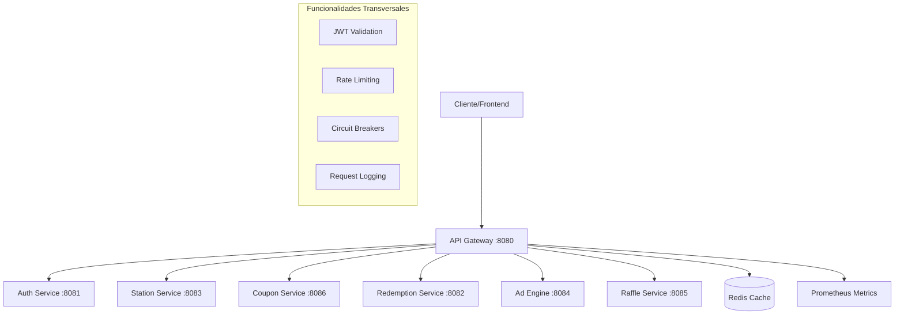

# API Gateway Service

## 🌐 Descripción General

El API Gateway es el punto de entrada único para todas las solicitudes del sistema Gasolinera JSM. Actúa como un proxy inteligente que enruta las solicitudes a los microservicios correspondientes, proporcionando funcionalidades transversales como autenticación, autorización, rate limiting, y monitoreo.

## 🏗️ Arquitectura



## 🚀 Funcionalidades Principales

### ✅ Implementadas

- **Routing Inteligente**: Enrutamiento automático basado en paths
- **Circuit Breakers**: Protección contra fallos en cascada
- **Request/Response Logging**: Trazabilidad completa de requests
- **Manejo Global de Excepciones**: Respuestas de error consistentes
- **Fallback Controllers**: Respuestas por defecto cuando servicios fallan
- **Configuración por Perfiles**: Diferentes configuraciones por ambiente

### 🔧 En Desarrollo

- **Autenticación JWT**: Validación de tokens en todas las rutas protegidas
- **Rate Limiting**: Límites de requests por usuario/IP
- **RBAC**: Control de acceso basado en roles
- **Caching**: Cache inteligente de respuestas
- **Métricas Avanzadas**: Monitoreo detallado de performance

## 📋 Configuración de Rutas

### Rutas Públicas (Sin Autenticación)

```yaml
# Health checks
GET /actuator/health
GET /actuator/info

# Autenticación
POST /api/auth/login
POST /api/auth/register
POST /api/auth/verify-otp
```

### Rutas Protegidas (Requieren JWT)

```yaml
# Gestión de Usuarios
GET    /api/auth/profile
PUT    /api/auth/profile
POST   /api/auth/logout

# Estaciones de Servicio
GET    /api/stations/**
POST   /api/stations/**
PUT    /api/stations/**
DELETE /api/stations/**

# Sistema de Cupones
GET    /api/coupons/**
POST   /api/coupons/generate
POST   /api/coupons/validate

# Motor de Anuncios
GET    /api/ads/**
POST   /api/ads/view
PUT    /api/ads/**

# Sistema de Rifas
GET    /api/raffles/**
POST   /api/raffles/participate
GET    /api/raffles/winners

# Canjes y Recompensas
GET    /api/redemptions/**
POST   /api/redemptions/redeem
GET    /api/redemptions/history
```

## 🔒 Seguridad

### Autenticación JWT

```kotlin
// Configuración de JWT
jwt:
  secret: ${JWT_SECRET:your-secret-key}
  expiration: 86400000 # 24 horas
  refresh-expiration: 604800000 # 7 días
```

### Roles y Permisos

| Rol          | Descripción          | Permisos                          |
| ------------ | -------------------- | --------------------------------- |
| `USER`       | Cliente final        | Cupones, rifas, perfil            |
| `EMPLOYEE`   | Empleado de estación | Generar cupones, ver estadísticas |
| `OWNER`      | Dueño de estación    | Gestión completa de estación      |
| `ADVERTISER` | Anunciante           | Gestión de anuncios               |
| `ADMIN`      | Administrador        | Acceso completo al sistema        |

### Rate Limiting

```yaml
# Configuración por defecto
rate-limiting:
  default:
    requests-per-second: 100
    burst-capacity: 200

  # Límites específicos por endpoint
  endpoints:
    '/api/auth/login':
      requests-per-second: 5
      burst-capacity: 10
    '/api/coupons/generate':
      requests-per-second: 10
      burst-capacity: 20
```

## 🔧 Configuración

### Variables de Entorno

```bash
# Configuración del Gateway
SERVER_PORT=8080
SPRING_PROFILES_ACTIVE=development

# URLs de Servicios
AUTH_SERVICE_URL=http://auth-service:8081
STATION_SERVICE_URL=http://station-service:8083
COUPON_SERVICE_URL=http://coupon-service:8086
REDEMPTION_SERVICE_URL=http://redemption-service:8082
AD_ENGINE_URL=http://ad-engine:8084
RAFFLE_SERVICE_URL=http://raffle-service:8085

# Seguridad
JWT_SECRET=your-super-secret-jwt-key-here
CORS_ALLOWED_ORIGINS=http://localhost:3000,http://localhost:3001,http://localhost:3002

# Rate Limiting
RATE_LIMIT_REQUESTS_PER_SECOND=100
RATE_LIMIT_BURST_CAPACITY=200

# Circuit Breaker
CIRCUIT_BREAKER_TIMEOUT=5000
CIRCUIT_BREAKER_FAILURE_THRESHOLD=50
CIRCUIT_BREAKER_RECOVERY_TIME=30000

# Redis (para rate limiting y caching)
REDIS_HOST=localhost
REDIS_PORT=6379
REDIS_PASSWORD=

# Monitoreo
MANAGEMENT_ENDPOINTS_WEB_EXPOSURE_INCLUDE=health,info,metrics,prometheus
MANAGEMENT_ENDPOINT_HEALTH_SHOW_DETAILS=always
```

### Configuración por Ambiente

#### Development (`application-development.yml`)

```yaml
spring:
  cloud:
    gateway:
      routes:
        - id: auth-service
          uri: http://localhost:8081
          predicates:
            - Path=/api/auth/**
          filters:
            - name: RequestRateLimiter
              args:
                rate-limiter: '#{@redisRateLimiter}'
                key-resolver: '#{@userKeyResolver}'
```

#### Production (`application-production.yml`)

```yaml
spring:
  cloud:
    gateway:
      routes:
        - id: auth-service
          uri: lb://auth-service # Load balanced
          predicates:
            - Path=/api/auth/**
          filters:
            - name: CircuitBreaker
              args:
                name: auth-service-cb
                fallbackUri: forward:/fallback/auth
```

## 🚀 Instalación y Ejecución

### Prerrequisitos

- Java 17+
- Redis (para rate limiting)
- Servicios backend ejecutándose

### Ejecución Local

```bash
# Clonar el repositorio
git clone <repository-url>
cd services/api-gateway

# Configurar variables de entorno
cp .env.example .env
# Editar .env con tus configuraciones

# Ejecutar con Gradle
./gradlew bootRun

# O ejecutar con perfil específico
./gradlew bootRun --args='--spring.profiles.active=development'
```

### Ejecución con Docker

```bash
# Construir imagen
docker build -t gasolinera-jsm/api-gateway .

# Ejecutar contenedor
docker run -p 8080:8080 \
  -e SPRING_PROFILES_ACTIVE=development \
  -e REDIS_HOST=redis \
  gasolinera-jsm/api-gateway
```

### Ejecución con Docker Compose

```bash
# Desde el directorio raíz del proyecto
docker-compose -f docker-compose.dev.yml up api-gateway
```

## 📊 Monitoreo y Métricas

### Health Checks

```bash
# Health check general
curl http://localhost:8080/actuator/health

# Health check detallado
curl http://localhost:8080/actuator/health/detailed
```

### Métricas Disponibles

```bash
# Métricas de Prometheus
curl http://localhost:8080/actuator/prometheus

# Métricas específicas del Gateway
curl http://localhost:8080/actuator/metrics/gateway.requests
curl http://localhost:8080/actuator/metrics/spring.cloud.gateway.requests
```

### Métricas Personalizadas

| Métrica                             | Descripción                  | Tipo      |
| ----------------------------------- | ---------------------------- | --------- |
| `gateway_requests_total`            | Total de requests procesados | Counter   |
| `gateway_request_duration_seconds`  | Duración de requests         | Histogram |
| `gateway_circuit_breaker_state`     | Estado de circuit breakers   | Gauge     |
| `gateway_rate_limit_exceeded_total` | Rate limits excedidos        | Counter   |
| `gateway_auth_failures_total`       | Fallos de autenticación      | Counter   |

## 🧪 Testing

### Tests Unitarios

```bash
# Ejecutar todos los tests
./gradlew test

# Ejecutar tests específicos
./gradlew test --tests "*GatewayConfigTest*"
```

### Tests de Integración

```bash
# Tests de integración con servicios reales
./gradlew integrationTest

# Tests de carga
./gradlew loadTest
```

### Ejemplos de Requests

#### Autenticación

```bash
# Login
curl -X POST http://localhost:8080/api/auth/login \
  -H "Content-Type: application/json" \
  -d '{"email": "user@example.com", "password": "password123"}'

# Usar token JWT
curl -X GET http://localhost:8080/api/auth/profile \
  -H "Authorization: Bearer <jwt-token>"
```

#### Generar Cupón

```bash
curl -X POST http://localhost:8080/api/coupons/generate \
  -H "Authorization: Bearer <jwt-token>" \
  -H "Content-Type: application/json" \
  -d '{"stationId": "station-123", "amount": 5000}'
```

## 🔍 Troubleshooting

### Problemas Comunes

#### 1. Service Unavailable (503)

```bash
# Verificar que los servicios backend estén ejecutándose
curl http://localhost:8081/actuator/health  # Auth Service
curl http://localhost:8083/actuator/health  # Station Service
# ... otros servicios
```

#### 2. Rate Limit Exceeded (429)

```bash
# Verificar configuración de rate limiting
curl http://localhost:8080/actuator/configprops | grep rate

# Verificar Redis connection
redis-cli ping
```

#### 3. JWT Token Invalid (401)

```bash
# Verificar configuración JWT
echo $JWT_SECRET

# Verificar formato del token
curl -X GET http://localhost:8080/api/auth/validate-token \
  -H "Authorization: Bearer <jwt-token>"
```

### Logs Útiles

```bash
# Ver logs del Gateway
docker logs api-gateway

# Ver logs con filtro
docker logs api-gateway | grep ERROR

# Logs en tiempo real
docker logs -f api-gateway
```

## 📚 Documentación Adicional

### API Documentation

- **Swagger UI**: http://localhost:8080/swagger-ui.html
- **OpenAPI Spec**: http://localhost:8080/v3/api-docs

### Arquitectura

- [Diagrama de Arquitectura](./docs/architecture.md)
- [Flujo de Requests](./docs/request-flow.md)
- [Configuración de Seguridad](./docs/security.md)

### Operaciones

- [Guía de Deployment](./docs/deployment.md)
- [Monitoreo y Alertas](./docs/monitoring.md)
- [Runbook de Incidentes](./docs/runbook.md)

## 🤝 Contribución

### Desarrollo

1. Fork el repositorio
2. Crear branch de feature: `git checkout -b feature/nueva-funcionalidad`
3. Commit cambios: `git commit -am 'Agregar nueva funcionalidad'`
4. Push al branch: `git push origin feature/nueva-funcionalidad`
5. Crear Pull Request

### Estándares de Código

- Seguir convenciones de Kotlin
- Documentar funciones públicas
- Incluir tests para nueva funcionalidad
- Mantener cobertura de tests > 80%

## 📄 Licencia

Este proyecto está bajo la Licencia MIT. Ver [LICENSE](../../LICENSE) para más detalles.

---

## 🔗 Enlaces Útiles

- [Spring Cloud Gateway Documentation](https://spring.io/projects/spring-cloud-gateway)
- [Circuit Breaker Pattern](https://martinfowler.com/bliki/CircuitBreaker.html)
- [JWT Best Practices](https://auth0.com/blog/a-look-at-the-latest-draft-for-jwt-bcp/)
- [API Gateway Pattern](https://microservices.io/patterns/apigateway.html)

---

**Mantenido por**: Equipo de Desarrollo Gasolinera JSM
**Última actualización**: Agosto 2025
**Versión**: 1.0.0
