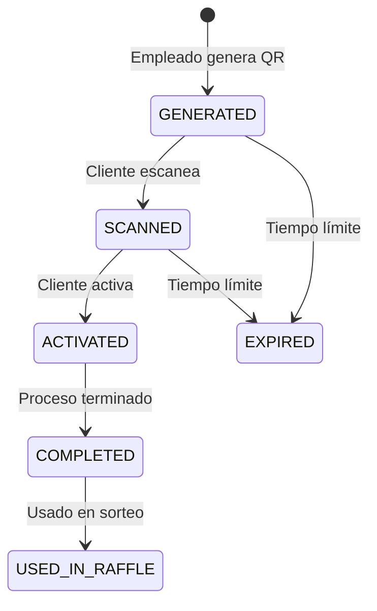

# Coupon Service

Servicio de gestión de cupones QR para la plataforma Gasolinera JSM. Maneja la generación, escaneo, activación y seguimiento de cupones QR que los clientes usan para participar en sorteos.

## Funcionalidades

### Gestión de Cupones QR

- **Generación**: Los empleados generan códigos QR únicos por transacción
- **Escaneo**: Los clientes escanean QR codes para obtener tickets
- **Activación**: Los clientes activan cupones para comenzar el proceso de anuncios
- **Seguimiento**: Monitoreo completo del ciclo de vida del cupón

### Sistema de Tickets

- **Tickets Base**: 1 ticket por cada ₡5,000 de compra
- **Tickets Bonus**: Multiplicadores por ver anuncios (hasta 10x)
- **Acumulación**: Los tickets se acumulan para sorteos semanales y anuales

### Estadísticas y Reportes

- **Por Estación**: Métricas de rendimiento por gasolinera
- **Por Empleado**: Seguimiento individual de generación de cupones
- **Conversión**: Tasas de escaneo y activación

## Arquitectura

### Estructura del Proyecto

```
src/main/kotlin/com/gasolinerajsm/coupon/
├── controller/              # Controladores REST
│   └── QRCouponController.kt
├── domain/                  # Entidades de dominio
│   ├── QRCoupon.kt         # Entidad principal
│   └── AdView.kt           # Registro de visualizaciones
├── dto/                    # Objetos de transferencia
│   └── CouponDTOs.kt
├── service/                # Lógica de negocio
│   ├── QRCouponService.kt  # Servicio principal
│   ├── QRCodeGenerator.kt  # Generación de códigos QR
│   └── TokenGenerator.kt   # Generación de tokens únicos
└── repository/             # Acceso a datos
    └── QRCouponRepository.kt
```

### Estados del Cupón



## API Endpoints

### Generación de Cupones (Empleados)

```http
POST /api/v1/coupons/generate
Authorization: Bearer <employee_token>
Content-Type: application/json

{
  "stationId": "uuid",
  "amount": 10000,
  "employeeId": "uuid"
}
```

**Respuesta:**

```json
{
  "couponId": "uuid",
  "qrCode": "unique_qr_code",
  "qrImage": "base64_image",
  "token": "unique_token",
  "baseTickets": 2,
  "expiresAt": "2024-01-01T23:59:59"
}
```

### Escaneo de Cupones (Clientes)

```http
POST /api/v1/coupons/scan
Authorization: Bearer <client_token>
Content-Type: application/json

{
  "qrCode": "scanned_qr_code",
  "userId": "uuid"
}
```

### Activación de Cupones (Clientes)

```http
POST /api/v1/coupons/activate
Authorization: Bearer <client_token>
Content-Type: application/json

{
  "token": "coupon_token",
  "userId": "uuid"
}
```

### Consulta de Tickets de Usuario

```http
GET /api/v1/coupons/user/{userId}
Authorization: Bearer <client_token>
```

### Estadísticas de Estación

```http
GET /api/v1/coupons/station/{stationId}/stats?days=30
Authorization: Bearer <owner_token>
```

### Estadísticas de Empleado

```http
GET /api/v1/coupons/employee/{employeeId}/stats?days=30
Authorization: Bearer <employee_token>
```

## Configuración

### Variables de Entorno

```yaml
# Base de datos
SPRING_DATASOURCE_URL: jdbc:postgresql://localhost:5432/gasolinera_dev
SPRING_DATASOURCE_USERNAME: dev_user
SPRING_DATASOURCE_PASSWORD: dev_password

# Redis (para caché)
SPRING_DATA_REDIS_HOST: localhost
SPRING_DATA_REDIS_PORT: 6379

# RabbitMQ (para eventos)
SPRING_RABBITMQ_HOST: localhost
SPRING_RABBITMQ_PORT: 5672
SPRING_RABBITMQ_USERNAME: guest
SPRING_RABBITMQ_PASSWORD: guest

# JWT
JWT_SECRET: your-secret-key
JWT_EXPIRATION: 86400000

# QR Code Settings
QR_CODE_SIZE: 300
QR_CODE_FORMAT: PNG
```

## Desarrollo

### Prerrequisitos

- Java 17+
- PostgreSQL 15+
- Redis 7+
- RabbitMQ 3.12+

### Ejecutar Localmente

```bash
# Desde la raíz del proyecto
./gradlew :coupon-service:bootRun

# O usando Docker Compose
docker-compose -f docker-compose.dev.yml up coupon-service
```

### Ejecutar Tests

```bash
./gradlew :coupon-service:test
```

### Generar Documentación OpenAPI

```bash
./gradlew :coupon-service:generateOpenApiDocs
```

## Reglas de Negocio

### Generación de Tickets

- **Base**: 1 ticket por cada ₡5,000 de compra
- **Mínimo**: ₡5,000 (1 ticket)
- **Máximo**: Sin límite (múltiplos de ₡5,000)

### Multiplicadores por Anuncios

- **10 segundos**: 2x tickets
- **15 segundos**: 3x tickets
- **30 segundos**: 4x tickets
- **1 minuto**: 6x tickets
- **10 minutos**: 10x tickets

### Expiración

- **Cupones generados**: 24 horas para escanear
- **Cupones escaneados**: 1 hora para activar
- **Proceso de anuncios**: 30 minutos para completar

## Monitoreo

### Health Check

```http
GET /actuator/health
```

### Métricas

```http
GET /actuator/prometheus
```

### Métricas Personalizadas

- `coupons.generated.total` - Total de cupones generados
- `coupons.scanned.total` - Total de cupones escaneados
- `coupons.activated.total` - Total de cupones activados
- `tickets.issued.total` - Total de tickets emitidos
- `conversion.rate` - Tasa de conversión escaneo/activación

## Integración con Otros Servicios

### Ad Engine

- Notifica visualizaciones de anuncios
- Recibe multiplicadores de tickets

### Raffle Service

- Envía tickets acumulados para sorteos
- Marca cupones como usados en sorteos

### Station Service

- Valida estaciones y empleados
- Obtiene información de ubicación

## Próximos Pasos

1. **Implementar eventos** - Integrar con RabbitMQ para comunicación asíncrona
2. **Mejorar validaciones** - Añadir validaciones de negocio más robustas
3. **Cache inteligente** - Implementar caché para consultas frecuentes
4. **Métricas avanzadas** - Añadir más métricas de negocio
5. **Tests de integración** - Completar suite de tests con TestContainers

## Contribución

1. Mantener la separación clara entre controladores, servicios y repositorios
2. Validar todas las reglas de negocio en la capa de servicio
3. Documentar cambios en la API con OpenAPI
4. Escribir tests para todos los casos de uso críticos
