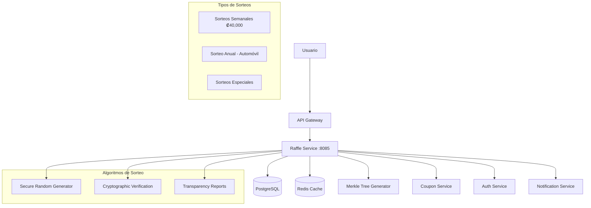

# Raffle Service

## 🎲 Descripción General

El Raffle Service es el corazón del sistema de sorteos de Gasolinera JSM. Gestiona sorteos semanales de ₡40,000 y el sorteo anual de un automóvil, proporcionando transparencia total mediante Merkle Trees y algoritmos criptográficamente seguros para la selección de ganadores.

## 🏗️ Arquitectura



## 🎯 Funcionalidades Principales

### ✅ Implementadas

- **Gestión de Sorteos**: Creación y administración de sorteos semanales y anuales
- **Sistema de Participantes**: Registro y validación de participantes con tickets
- **Algoritmos de Sorteo**: Selección aleatoria criptográficamente segura
- **Merkle Trees**: Generación de árboles para transparencia y verificación
- **Reportes de Transparencia**: Documentación completa de cada sorteo
- **Health Checks**: Monitoreo de estado del servicio

### 🔧 En Desarrollo

- **Dashboard Público**: Interfaz para verificación de resultados
- **Blockchain Integration**: Registro inmutable en blockchain
- **Notificaciones Automáticas**: Alertas a ganadores y participantes
- **Analytics Avanzados**: Métricas detalladas de participación
- **API Pública**: Endpoints para verificación externa

## 📋 Modelo de Datos

### Entidades Principales

```kotlin
// Sorteo
data class Raffle(
    val id: String,
    val name: String,
    val type: RaffleType, // WEEKLY, ANNUAL, SPECIAL
    val prize: Prize,
    val startDate: LocalDateTime,
    val endDate: LocalDateTime,
    val drawDate: LocalDateTime,
    val status: RaffleStatus, // ACTIVE, COMPLETED, CANCELLED
    val maxParticipants: Int?,
    val merkleRoot: String?
)

// Participante
data class Participant(
    val id: String,
    val raffleId: String,
    val userId: String,
    val ticketCount: Int,
    val participationDate: LocalDateTime,
    val merkleProof: List<String>?
)

// Ganador
data class Winner(
    val id: String,
    val raffleId: String,
    val participantId: String,
    val prize: Prize,
    val selectionDate: LocalDateTime,
    val claimed: Boolean,
    val claimDate: LocalDateTime?
)
```

## 📋 API Endpoints

### Participación en Sorteos

```yaml
# Obtener sorteos activos
GET /api/raffles/active
Response:
  [
    {
      "id": "raffle-123",
      "name": "Sorteo Semanal #45",
      "type": "WEEKLY",
      "prize": {
        "type": "CASH",
        "amount": 40000,
        "currency": "CRC"
      },
      "endDate": "2025-08-30T23:59:59",
      "participantCount": 1250
    }
  ]

# Participar en sorteo
POST /api/raffles/{raffleId}/participate
Headers:
  Authorization: Bearer <jwt-token>
Body:
  {
    "ticketCount": 5,
    "userId": "user-123"
  }
Response:
  {
    "participationId": "part-456",
    "raffleId": "raffle-123",
    "ticketCount": 5,
    "totalTickets": 25,
    "participationDate": "2025-08-23T10:30:00Z"
  }

# Consultar participaciones del usuario
GET /api/raffles/my-participations
Headers:
  Authorization: Bearer <jwt-token>
Response:
  [
    {
      "raffleId": "raffle-123",
      "raffleName": "Sorteo Semanal #45",
      "ticketCount": 5,
      "participationDate": "2025-08-23T10:30:00Z",
      "status": "ACTIVE"
    }
  ]
```

### Consulta de Resultados

```yaml
# Obtener ganadores de un sorteo
GET /api/raffles/{raffleId}/winners
Response:
  [
    {
      "position": 1,
      "participantId": "part-789",
      "userId": "user-456",
      "username": "juan.perez",
      "prize": {
        "type": "CASH",
        "amount": 40000,
        "currency": "CRC"
      },
      "selectionDate": "2025-08-24T20:00:00Z",
      "claimed": false
    }
  ]

# Verificar transparencia de sorteo
GET /api/raffles/{raffleId}/transparency
Response:
  {
    "raffleId": "raffle-123",
    "merkleRoot": "0x1a2b3c4d...",
    "totalParticipants": 1250,
    "totalTickets": 8750,
    "randomSeed": "0x9f8e7d6c...",
    "algorithm": "SHA-256 + Secure Random",
    "verificationUrl": "https://verify.gasolinerajsm.com/raffle-123"
  }
```

### Administración (Admin/Owner)

```yaml
# Crear nuevo sorteo
POST /api/raffles
Headers:
  Authorization: Bearer <admin-token>
Body:
  {
    "name": "Sorteo Especial Navidad",
    "type": "SPECIAL",
    "prize": {
      "type": "CASH",
      "amount": 100000,
      "currency": "CRC"
    },
    "startDate": "2025-12-01T00:00:00Z",
    "endDate": "2025-12-24T23:59:59Z",
    "drawDate": "2025-12-25T20:00:00Z"
  }

# Ejecutar sorteo
POST /api/raffles/{raffleId}/draw
Headers:
  Authorization: Bearer <admin-token>
Response:
  {
    "raffleId": "raffle-123",
    "winners": [...],
    "merkleRoot": "0x1a2b3c4d...",
    "executionTime": "2025-08-24T20:00:00Z",
    "transparencyReport": "https://reports.gasolinerajsm.com/raffle-123"
  }

# Obtener métricas de sorteo
GET /api/raffles/{raffleId}/metrics
Response:
  {
    "participantCount": 1250,
    "ticketCount": 8750,
    "averageTicketsPerUser": 7.0,
    "participationRate": 0.85,
    "geographicDistribution": {
      "San José": 450,
      "Cartago": 300,
      "Alajuela": 250,
      "Heredia": 200,
      "Otros": 50
    }
  }
```

## 🔒 Algoritmos de Sorteo

### Generación de Números Aleatorios

```kotlin
// Configuración de seguridad
random:
  algorithm: "SHA1PRNG"
  seed-source: "SYSTEM_ENTROPY"
  verification: "CRYPTOGRAPHIC_HASH"

// Proceso de selección
1. Recopilar todos los participantes elegibles
2. Generar Merkle Tree con todos los participantes
3. Usar semilla criptográficamente segura
4. Aplicar algoritmo de selección ponderado por tickets
5. Generar pruebas de verificación
6. Crear reporte de transparencia
```

### Merkle Tree para Transparencia

```kotlin
// Estructura del árbol
MerkleTree {
  root: String,           // Hash raíz del árbol
  leaves: List<String>,   // Hashes de participantes
  proofs: Map<String, List<String>> // Pruebas de inclusión
}

// Verificación pública
fun verifyParticipant(
  participantHash: String,
  merkleProof: List<String>,
  merkleRoot: String
): Boolean
```

## 🔧 Configuración

### Variables de Entorno

```bash
# Configuración del Servicio
SERVER_PORT=8085
SPRING_PROFILES_ACTIVE=development

# Base de Datos
DATABASE_URL=jdbc:postgresql://localhost:5432/gasolinera_jsm
DATABASE_USERNAME=postgres
DATABASE_PASSWORD=password

# Redis
REDIS_HOST=localhost
REDIS_PORT=6379
REDIS_PASSWORD=

# JWT
JWT_SECRET=your-super-secret-jwt-key

# Configuración de Sorteos
RAFFLE_WEEKLY_PRIZE=40000
RAFFLE_ANNUAL_PRIZE_TYPE=CAR
RAFFLE_MAX_TICKETS_PER_USER=100

# Algoritmos de Seguridad
RANDOM_ALGORITHM=SHA1PRNG
MERKLE_HASH_ALGORITHM=SHA-256
VERIFICATION_ENABLED=true

# Notificaciones
NOTIFICATION_SERVICE_URL=http://notification-service:8087
EMAIL_NOTIFICATIONS_ENABLED=true
SMS_NOTIFICATIONS_ENABLED=true

# Blockchain (opcional)
BLOCKCHAIN_ENABLED=false
BLOCKCHAIN_NETWORK=ethereum-testnet
BLOCKCHAIN_CONTRACT_ADDRESS=0x...
```

### Configuración por Ambiente

#### Development (`application-development.yml`)

```yaml
raffle:
  scheduling:
    weekly-draw: '0 0 20 * * SUN' # Domingos 8 PM
    annual-draw: '0 0 20 31 12 *' # 31 Diciembre 8 PM

  prizes:
    weekly:
      amount: 40000
      currency: CRC
    annual:
      type: CAR
      brand: 'Toyota'
      model: 'Corolla'
      year: 2025

  limits:
    max-tickets-per-user: 100
    max-participants: 10000

  transparency:
    merkle-tree-enabled: true
    public-verification: true
    blockchain-recording: false

logging:
  level:
    com.gasolinerajsm.raffleservice: DEBUG
```

#### Production (`application-production.yml`)

```yaml
raffle:
  scheduling:
    weekly-draw: '0 0 20 * * SUN'
    annual-draw: '0 0 20 31 12 *'

  transparency:
    merkle-tree-enabled: true
    public-verification: true
    blockchain-recording: true
    audit-logging: true

  security:
    random-seed-verification: true
    cryptographic-proofs: true
    external-audit: true

logging:
  level:
    com.gasolinerajsm.raffleservice: INFO
```

## 🚀 Instalación y Ejecución

### Prerrequisitos

- Java 17+
- PostgreSQL 13+
- Redis 6+

### Ejecución Local

```bash
# Clonar el repositorio
git clone <repository-url>
cd services/raffle-service

# Configurar variables de entorno
cp .env.example .env
# Editar .env con tus configuraciones

# Ejecutar con Gradle
./gradlew bootRun

# O con perfil específico
./gradlew bootRun --args='--spring.profiles.active=development'
```

### Ejecución con Docker

```bash
# Construir imagen
docker build -t gasolinera-jsm/raffle-service .

# Ejecutar contenedor
docker run -p 8085:8085 \
  -e SPRING_PROFILES_ACTIVE=development \
  -e DATABASE_URL=jdbc:postgresql://postgres:5432/gasolinera_jsm \
  gasolinera-jsm/raffle-service
```

## 📊 Monitoreo y Métricas

### Health Checks

```bash
# Health check general
curl http://localhost:8085/actuator/health

# Verificar algoritmos de sorteo
curl http://localhost:8085/actuator/health/raffle-algorithms

# Estado de Merkle Tree generator
curl http://localhost:8085/actuator/health/merkle-tree
```

### Métricas de Negocio

| Métrica                           | Descripción                         | Tipo      |
| --------------------------------- | ----------------------------------- | --------- |
| `raffles_active_total`            | Sorteos activos                     | Gauge     |
| `participants_total`              | Total de participantes              | Counter   |
| `tickets_distributed_total`       | Tickets distribuidos                | Counter   |
| `winners_selected_total`          | Ganadores seleccionados             | Counter   |
| `draw_execution_duration_seconds` | Duración de ejecución de sorteos    | Histogram |
| `transparency_reports_generated`  | Reportes de transparencia generados | Counter   |

## 🧪 Testing

### Tests Unitarios

```bash
# Ejecutar todos los tests
./gradlew test

# Tests de algoritmos de sorteo
./gradlew test --tests "*RaffleAlgorithmTest*"

# Tests de Merkle Tree
./gradlew test --tests "*MerkleTreeTest*"
```

### Tests de Integración

```bash
# Tests de integración completos
./gradlew integrationTest

# Tests de transparencia
./gradlew transparencyTest
```

### Ejemplos de Requests

#### Participar en Sorteo

```bash
curl -X POST http://localhost:8085/api/raffles/raffle-123/participate \
  -H "Authorization: Bearer <jwt-token>" \
  -H "Content-Type: application/json" \
  -d '{
    "ticketCount": 5,
    "userId": "user-123"
  }'
```

#### Verificar Transparencia

```bash
curl -X GET http://localhost:8085/api/raffles/raffle-123/transparency \
  -H "Content-Type: application/json"
```

## 🔍 Troubleshooting

### Problemas Comunes

#### 1. Sorteo No Se Ejecuta

```bash
# Verificar configuración de scheduling
curl http://localhost:8085/actuator/scheduledtasks

# Verificar logs de ejecución
docker logs raffle-service | grep "draw execution"
```

#### 2. Merkle Tree No Se Genera

```bash
# Verificar participantes
curl http://localhost:8085/api/raffles/raffle-123/participants/count

# Verificar algoritmo
curl http://localhost:8085/actuator/health/merkle-tree
```

#### 3. Transparencia No Disponible

```bash
# Verificar configuración
echo $VERIFICATION_ENABLED

# Regenerar reporte
curl -X POST http://localhost:8085/api/raffles/raffle-123/regenerate-transparency \
  -H "Authorization: Bearer <admin-token>"
```

## 📈 Modelo de Negocio

### Tipos de Sorteos

| Tipo     | Frecuencia        | Premio                   | Participación                   |
| -------- | ----------------- | ------------------------ | ------------------------------- |
| Semanal  | Domingos 8 PM     | ₡40,000                  | Tickets acumulados en la semana |
| Anual    | 31 Diciembre      | Automóvil Toyota Corolla | Todos los tickets del año       |
| Especial | Fechas especiales | Variable                 | Según promoción                 |

### Sistema de Tickets

- **1 ticket** = ₡5,000 en combustible
- **Multiplicadores por anuncios**: 2x a 25x tickets
- **Límite por usuario**: 100 tickets por sorteo
- **Acumulación**: Tickets no utilizados pasan al sorteo anual

## 🔗 Integraciones

### Servicios Internos

- **Coupon Service**: Recibe tickets de usuarios por compras
- **Ad Engine**: Recibe multiplicadores por visualización de anuncios
- **Auth Service**: Validación de usuarios y permisos
- **Notification Service**: Envío de notificaciones a ganadores

### Servicios Externos

- **Blockchain Networks**: Registro inmutable de resultados
- **Email/SMS Providers**: Notificaciones a participantes
- **Audit Services**: Verificación externa de algoritmos

## 📚 Documentación Adicional

### API Documentation

- **Swagger UI**: http://localhost:8085/swagger-ui.html
- **OpenAPI Spec**: http://localhost:8085/v3/api-docs

### Transparencia

- **Portal de Verificación**: https://verify.gasolinerajsm.com
- **Reportes Públicos**: https://transparency.gasolinerajsm.com
- **Auditorías Externas**: https://audits.gasolinerajsm.com

## 🤝 Contribución

### Desarrollo

1. Fork el repositorio
2. Crear branch de feature: `git checkout -b feature/nueva-funcionalidad`
3. Commit cambios: `git commit -am 'Agregar nueva funcionalidad'`
4. Push al branch: `git push origin feature/nueva-funcionalidad`
5. Crear Pull Request

### Estándares de Código

- Seguir convenciones de Kotlin
- Documentar algoritmos críticos
- Incluir tests para funcionalidad de sorteos
- Mantener cobertura de tests > 90% para algoritmos críticos

## 📄 Licencia

Este proyecto está bajo la Licencia MIT. Ver [LICENSE](../../LICENSE) para más detalles.

---

## 🔗 Enlaces Útiles

- [Merkle Tree Implementation](https://en.wikipedia.org/wiki/Merkle_tree)
- [Cryptographically Secure Random Numbers](https://docs.oracle.com/javase/8/docs/api/java/security/SecureRandom.html)
- [Spring Boot Scheduling](https://spring.io/guides/gs/scheduling-tasks/)
- [Blockchain Integration Best Practices](https://ethereum.org/en/developers/docs/)

---

**Mantenido por**: Equipo de Desarrollo Gasolinera JSM
**Última actualización**: Agosto 2025
**Versión**: 1.0.0
