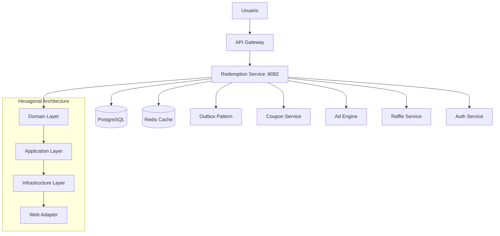

# Redemption Service

## 💰 Descripción General

El Redemption Service es el sistema de canjes y recompensas de Gasolinera JSM. Gestiona la redención de cupones QR, el procesamiento de puntos por visualización de anuncios, y la distribución de tickets para sorteos. Implementa arquitectura hexagonal para máxima flexibilidad y testabilidad.

## 🏗️ Arquitectura



## 🎯 Funcionalidades Principales

### ✅ Implementadas

- **Redención de Cupones QR**: Validación y procesamiento de cupones escaneados
- **Sistema de Puntos**: Acumulación de puntos por compras y visualización de anuncios
- **Distribución de Tickets**: Conversión de puntos a tickets para sorteos
- **Arquitectura Hexagonal**: Separación clara de responsabilidades
- **Outbox Pattern**: Garantía de consistencia eventual
- **Security QR**: Validación criptográfica de códigos QR

### 🔧 En Desarrollo

- **Dashboard de Usuario**: Interfaz para consultar historial de canjes
- **Sistema de Recompensas**: Catálogo de premios canjeables
- **Analytics Avanzados**: Métricas detalladas de comportamiento
- **Integración Blockchain**: Registro inmutable de transacciones
- **Notificaciones Push**: Alertas de canjes exitosos

## 📋 Modelo de Datos

### Entidades Principales

```kotlin
// Redención
data class Redemption(
    val id: String,
    val userId: String,
    val qrCode: String,
    val amount: BigDecimal,
    val pointsEarned: Int,
    val ticketsGenerated: Int,
    val redemptionDate: LocalDateTime,
    val status: RedemptionStatus,
    val stationId: String,
    val transactionHash: String?
)

// Comando de Redención
data class RedeemCommand(
    val qrCode: String,
    val userId: String,
    val stationId: String,
    val amount: BigDecimal,
    val timestamp: LocalDateTime
)

// Resultado de Redención
data class RedemptionResult(
    val success: Boolean,
    val redemptionId: String?,
    val pointsEarned: Int,
    val ticketsGenerated: Int,
    val message: String,
    val adOpportunity: AdOpportunity?
)
```

## 📋 API Endpoints

### Redención de Cupones

```yaml
# Redimir cupón QR
POST /api/redemptions/redeem
Headers:
  Authorization: Bearer <jwt-token>
Body:
  {
    "qrCode": "QR123456789",
    "userId": "user-123",
    "stationId": "station-456",
    "amount": 5000.00,
    "timestamp": "2025-08-23T10:30:00Z"
  }
Response:
  {
    "success": true,
    "redemptionId": "redemption-789",
    "pointsEarned": 50,
    "ticketsGenerated": 1,
    "message": "Cupón canjeado exitosamente",
    "adOpportunity": {
      "available": true,
      "multiplier": 2,
      "duration": 10
    }
  }

# Confirmar visualización de anuncio
POST /api/redemptions/confirm-ad
Headers:
  Authorization: Bearer <jwt-token>
Body:
  {
    "redemptionId": "redemption-789",
    "adId": "ad-123",
    "watchedDuration": 10,
    "completed": true
  }
Response:
  {
    "success": true,
    "bonusTickets": 1,
    "totalTickets": 2,
    "message": "Anuncio confirmado, tickets multiplicados"
  }
```

### Consulta de Historial

```yaml
# Obtener historial de canjes del usuario
GET /api/redemptions/history
Headers:
  Authorization: Bearer <jwt-token>
Query Parameters:
  - page: 0
  - size: 20
  - startDate: 2025-08-01
  - endDate: 2025-08-31
Response:
  {
    "content": [
      {
        "id": "redemption-789",
        "amount": 5000.00,
        "pointsEarned": 50,
        "ticketsGenerated": 2,
        "redemptionDate": "2025-08-23T10:30:00Z",
        "stationName": "Estación Central",
        "status": "COMPLETED"
      }
    ],
    "totalElements": 45,
    "totalPages": 3,
    "currentPage": 0
  }

# Obtener resumen de puntos y tickets
GET /api/redemptions/summary
Headers:
  Authorization: Bearer <jwt-token>
Response:
  {
    "totalPoints": 1250,
    "totalTickets": 87,
    "totalRedemptions": 25,
    "currentMonthPoints": 340,
    "currentMonthTickets": 23,
    "nextRaffleTickets": 87,
    "pointsToNextTicket": 50
  }
```

### Administración (Admin/Owner)

```yaml
# Obtener métricas de redención
GET /api/redemptions/metrics
Headers:
  Authorization: Bearer <admin-token>
Query Parameters:
  - stationId: station-456 (opcional)
  - startDate: 2025-08-01
  - endDate: 2025-08-31
Response:
  {
    "totalRedemptions": 1250,
    "totalAmount": 6250000.00,
    "totalPointsDistributed": 62500,
    "totalTicketsGenerated": 1250,
    "averageRedemptionValue": 5000.00,
    "topStations": [
      {
        "stationId": "station-456",
        "stationName": "Estación Central",
        "redemptions": 450,
        "amount": 2250000.00
      }
    ]
  }

# Obtener detalles de redención específica
GET /api/redemptions/{redemptionId}
Headers:
  Authorization: Bearer <admin-token>
Response:
  {
    "id": "redemption-789",
    "userId": "user-123",
    "userName": "Juan Pérez",
    "qrCode": "QR123456789",
    "amount": 5000.00,
    "pointsEarned": 50,
    "ticketsGenerated": 2,
    "redemptionDate": "2025-08-23T10:30:00Z",
    "stationId": "station-456",
    "stationName": "Estación Central",
    "status": "COMPLETED",
    "adViewed": true,
    "adMultiplier": 2,
    "transactionHash": "0x1a2b3c4d..."
  }
```

## 🔧 Configuración

### Variables de Entorno

```bash
# Configuración del Servicio
SERVER_PORT=8082
SPRING_PROFILES_ACTIVE=development

# Base de Datos
DATABASE_URL=jdbc:postgresql://localhost:5432/gasolinera_jsm
DATABASE_USERNAME=postgres
DATABASE_PASSWORD=password

# Redis
REDIS_HOST=localhost
REDIS_PORT=6379
REDIS_PASSWORD=

# JWT
JWT_SECRET=your-super-secret-jwt-key

# Configuración de Puntos y Tickets
POINTS_PER_COLONES=0.01  # 1 punto por cada ₡100
POINTS_PER_TICKET=100    # 100 puntos = 1 ticket
MIN_REDEMPTION_AMOUNT=1000  # Mínimo ₡1,000

# Configuración de Anuncios
AD_MULTIPLIER_ENABLED=true
AD_MAX_MULTIPLIER=25
AD_MIN_DURATION=10
AD_MAX_DURATION=600

# Outbox Pattern
OUTBOX_PROCESSING_INTERVAL=5000  # 5 segundos
OUTBOX_BATCH_SIZE=50
OUTBOX_RETRY_ATTEMPTS=3

# Servicios Externos
COUPON_SERVICE_URL=http://coupon-service:8086
AD_ENGINE_URL=http://ad-engine:8084
RAFFLE_SERVICE_URL=http://raffle-service:8085
```

### Configuración por Ambiente

#### Development (`application-development.yml`)

```yaml
redemption:
  points:
    per-colones: 0.01
    per-ticket: 100
    bonus-multiplier: 1.5

  ads:
    enabled: true
    max-multiplier: 25
    timeout: 30000

  validation:
    qr-expiry-minutes: 30
    duplicate-check-enabled: true

  outbox:
    processing-interval: 5000
    batch-size: 50
    retry-attempts: 3

logging:
  level:
    com.gasolinerajsm.redemptionservice: DEBUG
    org.springframework.transaction: DEBUG
```

#### Production (`application-production.yml`)

```yaml
redemption:
  points:
    per-colones: 0.01
    per-ticket: 100
    bonus-multiplier: 2.0

  ads:
    enabled: true
    max-multiplier: 25
    timeout: 15000

  validation:
    qr-expiry-minutes: 15
    duplicate-check-enabled: true
    fraud-detection: true

  outbox:
    processing-interval: 2000
    batch-size: 100
    retry-attempts: 5

logging:
  level:
    com.gasolinerajsm.redemptionservice: INFO
```

## 🏛️ Arquitectura Hexagonal

### Estructura de Capas

```
src/main/kotlin/com/gasolinerajsm/redemptionservice/
├── domain/                    # Capa de Dominio
│   ├── model/                # Entidades de dominio
│   ├── port/                 # Puertos (interfaces)
│   └── service/              # Servicios de dominio
├── application/              # Capa de Aplicación
│   ├── usecase/              # Casos de uso
│   ├── command/              # Comandos
│   └── query/                # Consultas
├── adapter/                  # Adaptadores
│   ├── in/                   # Adaptadores de entrada
│   │   └── web/              # Controladores REST
│   └── out/                  # Adaptadores de salida
│       ├── persistence/      # Repositorios
│       └── external/         # Servicios externos
└── infrastructure/           # Infraestructura
    ├── config/               # Configuración
    └── security/             # Seguridad
```

### Puertos y Adaptadores

```kotlin
// Puerto de entrada (Use Case)
interface RedeemCouponUseCase {
    fun redeem(command: RedeemCommand): RedemptionResult
}

// Puerto de salida (Repository)
interface RedemptionRepository {
    fun save(redemption: Redemption): Redemption
    fun findByUserId(userId: String): List<Redemption>
    fun findById(id: String): Redemption?
}

// Adaptador de entrada (Controller)
@RestController
class RedemptionController(
    private val redeemCouponUseCase: RedeemCouponUseCase
) {
    @PostMapping("/redeem")
    fun redeem(@RequestBody command: RedeemCommand): RedemptionResult {
        return redeemCouponUseCase.redeem(command)
    }
}

// Adaptador de salida (JPA Repository)
@Repository
class JpaRedemptionRepository(
    private val jpaRepository: SpringDataRedemptionRepository
) : RedemptionRepository {
    override fun save(redemption: Redemption): Redemption {
        return jpaRepository.save(redemption.toEntity()).toDomain()
    }
}
```

## 🚀 Instalación y Ejecución

### Prerrequisitos

- Java 17+
- PostgreSQL 13+
- Redis 6+

### Ejecución Local

```bash
# Clonar el repositorio
git clone <repository-url>
cd services/redemption-service

# Configurar variables de entorno
cp .env.example .env
# Editar .env con tus configuraciones

# Ejecutar con Gradle
./gradlew bootRun

# O con perfil específico
./gradlew bootRun --args='--spring.profiles.active=development'
```

### Ejecución con Docker

```bash
# Construir imagen
docker build -t gasolinera-jsm/redemption-service .

# Ejecutar contenedor
docker run -p 8082:8082 \
  -e SPRING_PROFILES_ACTIVE=development \
  -e DATABASE_URL=jdbc:postgresql://postgres:5432/gasolinera_jsm \
  gasolinera-jsm/redemption-service
```

## 📊 Monitoreo y Métricas

### Health Checks

```bash
# Health check general
curl http://localhost:8082/actuator/health

# Health check de QR security
curl http://localhost:8082/actuator/health/qr-security

# Health check de outbox processing
curl http://localhost:8082/actuator/health/outbox
```

### Métricas de Negocio

| Métrica                                  | Descripción                            | Tipo      |
| ---------------------------------------- | -------------------------------------- | --------- |
| `redemptions_total`                      | Total de redenciones procesadas        | Counter   |
| `redemptions_amount_total`               | Monto total canjeado                   | Counter   |
| `points_distributed_total`               | Puntos totales distribuidos            | Counter   |
| `tickets_generated_total`                | Tickets generados para sorteos         | Counter   |
| `redemption_processing_duration_seconds` | Duración de procesamiento              | Histogram |
| `ad_multiplier_applied_total`            | Multiplicadores aplicados por anuncios | Counter   |
| `outbox_events_processed_total`          | Eventos de outbox procesados           | Counter   |

## 🧪 Testing

### Tests Unitarios

```bash
# Ejecutar todos los tests
./gradlew test

# Tests de casos de uso
./gradlew test --tests "*UseCaseTest*"

# Tests de adaptadores
./gradlew test --tests "*AdapterTest*"
```

### Tests de Integración

```bash
# Tests de integración con TestContainers
./gradlew integrationTest

# Tests de API endpoints
./gradlew apiTest
```

### Ejemplos de Requests

#### Redimir Cupón

```bash
curl -X POST http://localhost:8082/api/redemptions/redeem \
  -H "Authorization: Bearer <jwt-token>" \
  -H "Content-Type: application/json" \
  -d '{
    "qrCode": "QR123456789",
    "userId": "user-123",
    "stationId": "station-456",
    "amount": 5000.00,
    "timestamp": "2025-08-23T10:30:00Z"
  }'
```

#### Consultar Historial

```bash
curl -X GET "http://localhost:8082/api/redemptions/history?page=0&size=10" \
  -H "Authorization: Bearer <jwt-token>"
```

## 🔍 Troubleshooting

### Problemas Comunes

#### 1. QR Code Invalid

```bash
# Verificar validez del QR
curl -X POST http://localhost:8086/api/coupons/validate \
  -H "Content-Type: application/json" \
  -d '{"qrCode": "QR123456789"}'

# Verificar configuración de expiración
echo $QR_EXPIRY_MINUTES
```

#### 2. Points Not Calculated

```bash
# Verificar configuración de puntos
curl http://localhost:8082/actuator/configprops | grep points

# Verificar logs de cálculo
docker logs redemption-service | grep "points calculation"
```

#### 3. Outbox Events Not Processing

```bash
# Verificar estado del outbox
curl http://localhost:8082/actuator/health/outbox

# Verificar eventos pendientes
curl http://localhost:8082/actuator/metrics/outbox.events.pending
```

### Logs Útiles

```bash
# Ver logs del Redemption Service
docker logs redemption-service

# Ver logs de transacciones
docker logs redemption-service | grep TRANSACTION

# Logs en tiempo real
docker logs -f redemption-service
```

## 💡 Patrones de Diseño Implementados

### Outbox Pattern

```kotlin
@Entity
data class OutboxEvent(
    val id: String,
    val aggregateId: String,
    val eventType: String,
    val eventData: String,
    val createdAt: LocalDateTime,
    val processed: Boolean = false,
    val processedAt: LocalDateTime? = null
)

@Component
class OutboxProcessor {
    @Scheduled(fixedDelay = 5000)
    fun processEvents() {
        val pendingEvents = outboxRepository.findUnprocessedEvents()
        pendingEvents.forEach { event ->
            try {
                publishEvent(event)
                markAsProcessed(event)
            } catch (e: Exception) {
                handleFailure(event, e)
            }
        }
    }
}
```

### Command Query Responsibility Segregation (CQRS)

```kotlin
// Command Side
interface RedeemCouponCommand {
    fun execute(command: RedeemCommand): RedemptionResult
}

// Query Side
interface RedemptionQueryService {
    fun findUserHistory(userId: String, pageable: Pageable): Page<Redemption>
    fun getUserSummary(userId: String): RedemptionSummary
}
```

## 🔗 Integraciones

### Servicios Internos

- **Coupon Service**: Validación de códigos QR
- **Ad Engine**: Obtención de oportunidades publicitarias
- **Raffle Service**: Envío de tickets generados
- **Auth Service**: Validación de usuarios y permisos

### Servicios Externos

- **Payment Gateways**: Procesamiento de recompensas monetarias
- **Notification Services**: Alertas de canjes exitosos
- **Analytics Platforms**: Envío de métricas de comportamiento
- **Blockchain Networks**: Registro inmutable de transacciones

## 📚 Documentación Adicional

### API Documentation

- **Swagger UI**: http://localhost:8082/swagger-ui.html
- **OpenAPI Spec**: http://localhost:8082/v3/api-docs

### Arquitectura

- [Hexagonal Architecture Guide](./docs/hexagonal-architecture.md)
- [Outbox Pattern Implementation](./docs/outbox-pattern.md)
- [Domain Driven Design](./docs/ddd.md)

### Operaciones

- [Deployment Guide](./docs/deployment.md)
- [Monitoring and Alerting](./docs/monitoring.md)
- [Incident Response](./docs/incident-response.md)

## 🤝 Contribución

### Desarrollo

1. Fork el repositorio
2. Crear branch de feature: `git checkout -b feature/nueva-funcionalidad`
3. Commit cambios: `git commit -am 'Agregar nueva funcionalidad'`
4. Push al branch: `git push origin feature/nueva-funcionalidad`
5. Crear Pull Request

### Estándares de Código

- Seguir principios de arquitectura hexagonal
- Implementar tests para todos los casos de uso
- Documentar decisiones de diseño
- Mantener cobertura de tests > 85%

## 📄 Licencia

Este proyecto está bajo la Licencia MIT. Ver [LICENSE](../../LICENSE) para más detalles.

---

## 🔗 Enlaces Útiles

- [Hexagonal Architecture](https://alistair.cockburn.us/hexagonal-architecture/)
- [Outbox Pattern](https://microservices.io/patterns/data/transactional-outbox.html)
- [Domain Driven Design](https://martinfowler.com/bliki/DomainDrivenDesign.html)
- [CQRS Pattern](https://martinfowler.com/bliki/CQRS.html)

---

**Mantenido por**: Equipo de Desarrollo Gasolinera JSM
**Última actualización**: Agosto 2025
**Versión**: 1.0.0
